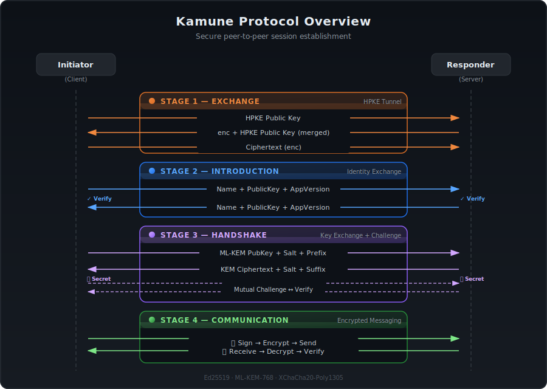
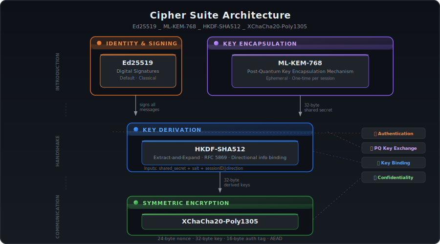
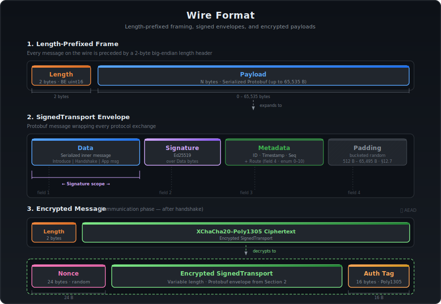
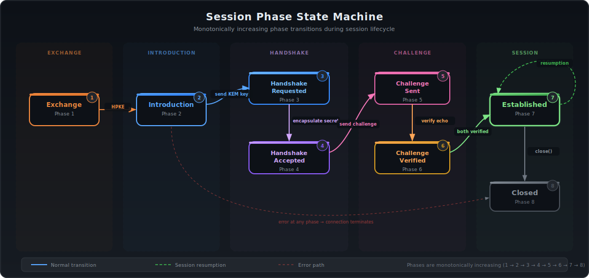
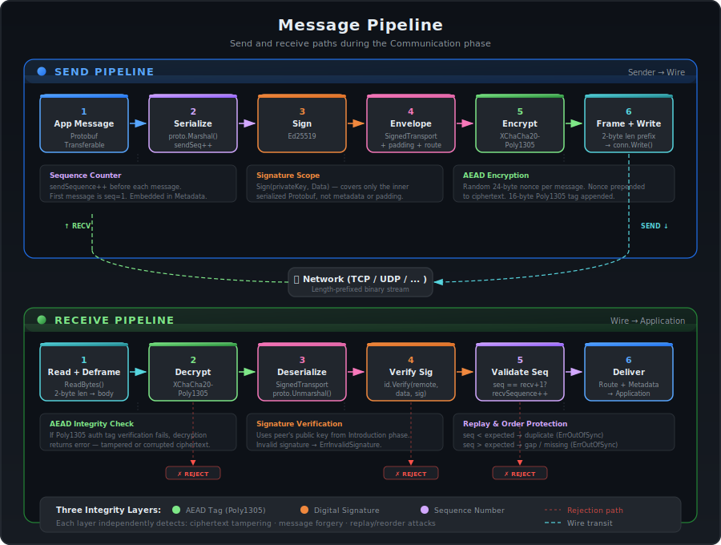
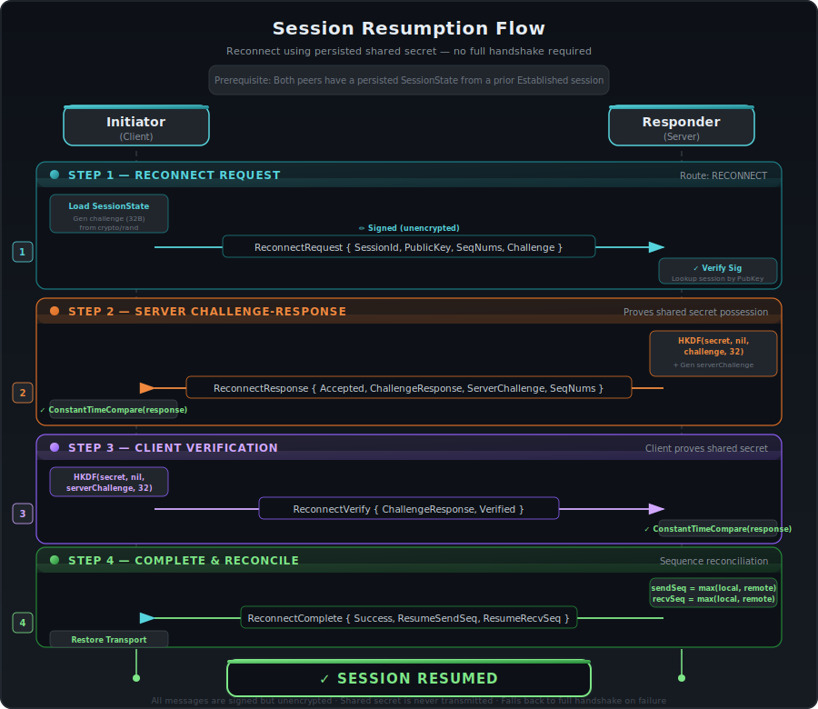
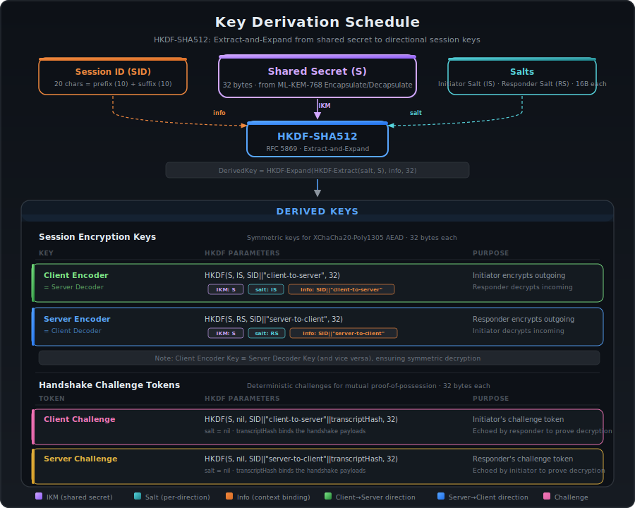
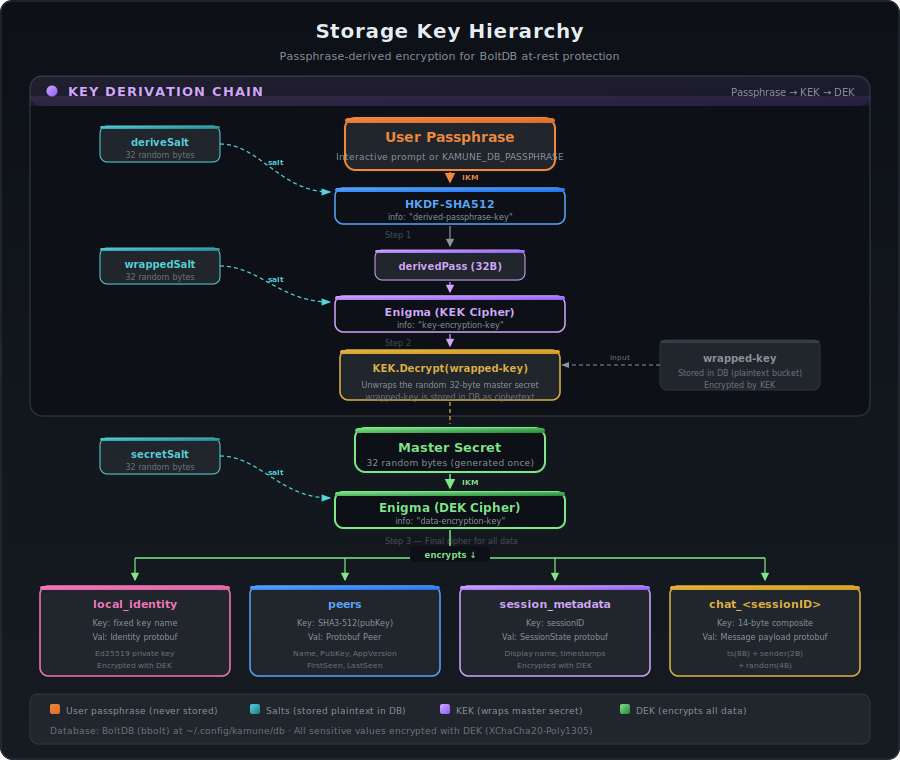

# Kamune Protocol Specification

**Version:** 0.2.0  
**Status:** Experimental  
**Suite:** `Ed25519_HPKE(MLKEM768-X25519, HKDF-SHA256, ChaCha20-Poly1305)_ChaCha20-Poly1305X`

---

## Table of Contents

1. [Overview](#1-overview)
2. [Terminology](#2-terminology)
3. [Cipher Suite](#3-cipher-suite)
4. [Wire Format](#4-wire-format)
5. [Routes](#5-routes)
6. [Session Phases](#6-session-phases)
7. [Protocol Flow: New Session](#7-protocol-flow-new-session)
   - 7.1 [Introduction](#71-introduction)
   - 7.2 [Handshake](#72-handshake)
   - 7.3 [Challenge Exchange](#73-challenge-exchange)
   - 7.4 [Communication](#74-communication)
8. [Protocol Flow: Session Resumption](#8-protocol-flow-session-resumption)
9. [Encryption and Key Derivation](#9-encryption-and-key-derivation)
10. [Message Integrity and Replay Protection](#10-message-integrity-and-replay-protection)
11. [Transport Layer](#11-transport-layer)
12. [Storage and Persistence](#12-storage-and-persistence)
13. [Routing and Dispatch](#13-routing-and-dispatch)
14. [Security Properties](#14-security-properties)
15. [Protobuf Schema Reference](#15-protobuf-schema-reference)
16. [Constants and Limits](#16-constants-and-limits)
17. [Error Conditions](#17-error-conditions)

---

## 1. Overview

Kamune is a peer-to-peer communication protocol designed for secure, real-time
messaging over untrusted networks. It provides end-to-end encryption with
post-quantum resistance, forward secrecy, mutual authentication, and message
integrity.

The protocol operates in three sequential stages — **Introduction**,
**Handshake**, and **Communication** — establishing a cryptographically secured
bidirectional channel between two peers without requiring an intermediary server.

The default cipher suite is
`Ed25519_HPKE(MLKEM768-X25519, HKDF-SHA256, ChaCha20-Poly1305)_ChaCha20-Poly1305X`.
An alternative fully post-quantum suite substituting ML-DSA-65 for Ed25519 is
supported for identity signing.

<picture>
  
</picture>

---

## 2. Terminology

| Term | Definition |
|------|-----------|
| **Initiator (Client)** | The party that opens the connection and begins the protocol exchange. |
| **Responder (Server)** | The party that accepts the connection and responds to protocol messages. |
| **Attester** | The cryptographic identity holder; signs messages with its private key. |
| **Identifier** | The verification counterpart of an Attester; verifies signatures with a public key. |
| **Peer** | A remote party identified by its public key, name, algorithm, and timestamps. |
| **Transport** | The encrypted, session-aware communication channel between two peers. |
| **Plain Transport** | The unencrypted, signature-verified serialization layer used during Introduction and Handshake. |
| **HPKE** | Hybrid Public Key Encryption (RFC 9180). Performs key encapsulation and key schedule derivation in a single operation during the Handshake phase. Configured with MLKEM768-X25519 KEM, HKDF-SHA256 KDF, and ChaCha20-Poly1305 AEAD. Bidirectional transport keys are exported from the HPKE context. |
| **Enigma** | The symmetric encryption/decryption engine wrapping XChaCha20-Poly1305 with keys exported from the HPKE context and further derived via HKDF-SHA512. |
| **Session** | A cryptographic context comprising HPKE-exported shared secret, salts, session ID, sequence counters, and phase. |
| **Route** | A typed tag on each message identifying its purpose and protocol phase. |
| **Fingerprint** | A human-readable representation of a public key (emoji, hex, or base64). |

---

## 3. Cipher Suite

<picture>
  
</picture>

### 3.1 Default Suite: `Ed25519_HPKE(MLKEM768-X25519, HKDF-SHA256, ChaCha20-Poly1305)_ChaCha20-Poly1305X`

| Component | Algorithm | Purpose |
|-----------|-----------|---------|
| **Identity Signing** | Ed25519 | Digital signatures for authentication and message integrity during Introduction, Handshake, and all signed transports. |
| **Key Establishment** | HPKE (RFC 9180) with MLKEM768-X25519 KEM | Hybrid Public Key Encryption using the X-Wing hybrid KEM (ML-KEM-768 + X25519). Performs key encapsulation and derives the shared key schedule in a single operation. Ephemeral keypairs are used per session. Uses Go's standard library `crypto/hpke`. |
| **HPKE KDF** | HKDF-SHA256 | Key derivation function within the HPKE key schedule. Used internally by HPKE to derive the shared context and for exporting bidirectional symmetric keys. |
| **HPKE AEAD** | ChaCha20-Poly1305 | AEAD cipher within the HPKE key schedule. Used internally by HPKE for its key scheduling; transport-level encryption uses the exported keys with XChaCha20-Poly1305 (see below). |
| **Transport Encryption** | XChaCha20-Poly1305 | Extended-nonce AEAD cipher for bidirectional message encryption and authentication during the Communication phase. Keys are exported from the HPKE context. |

### 3.2 Alternative Suite: `ML-DSA-65_HPKE(MLKEM768-X25519, HKDF-SHA256, ChaCha20-Poly1305)_ChaCha20-Poly1305X`

When the `MLDSA` algorithm is selected, ML-DSA-65 (CRYSTALS-Dilithium) replaces
Ed25519 for identity signing, providing full post-quantum security for both
key establishment and digital signatures.

### 3.3 Algorithm Negotiation

The signing algorithm is advertised during the Introduction phase via the
`Algorithm` field in the `Introduce` message. Both peers MUST use the same
algorithm family for signature verification. The algorithm enum is defined as:

| Value | Algorithm |
|-------|-----------|
| `0` | Invalid |
| `1` | Ed25519 |
| `2` | ML-DSA-65 |

---

## 4. Wire Format

<picture>
  
</picture>

### 4.1 Length-Prefixed Framing

All messages are transmitted using a **length-prefixed framing** protocol over
the underlying transport (TCP or UDP/KCP):

```
+------------------+-------------------+
| Length (2 bytes)  | Payload (N bytes) |
+------------------+-------------------+
```

- **Length**: A 2-byte unsigned integer in **big-endian** byte order indicating
  the size of the payload in bytes.
- **Payload**: The serialized Protobuf message, exactly `Length` bytes long.
- **Maximum message size**: 50 KiB (51,200 bytes). Messages exceeding this
  limit MUST be rejected with an error.

The length prefix is always written and read atomically. The receiver MUST
perform a full read (`io.ReadFull`) to consume exactly `Length` bytes.

### 4.2 Signed Transport Envelope

Every protocol message at the wire level is wrapped in a `SignedTransport`
Protobuf envelope:

```
SignedTransport {
  bytes    Data      = 1;   // Serialized inner message (Protobuf)
  bytes    Signature = 2;   // Digital signature over Data
  Metadata Metadata  = 3;   // Message metadata (ID, timestamp, sequence)
  bytes    Padding   = 4;   // Random padding (0–256 bytes)
  Route    Route     = 5;   // Message type/route identifier
}
```

**Fields:**

- **Data**: The Protobuf-serialized inner message (e.g., `Introduce`,
  `Handshake`, `ReconnectRequest`, or application data).
- **Signature**: The Ed25519 (or ML-DSA-65) signature computed over the raw
  `Data` bytes using the sender's private key.
- **Metadata**: Contains a unique message ID (random text), a Protobuf
  `Timestamp`, and a monotonically increasing sequence number.
- **Padding**: Random bytes of length `[0, 256)`, generated uniformly at
  random. Padding serves as a traffic analysis countermeasure by obscuring
  actual message sizes.
- **Route**: An enum identifying the message type and protocol phase.

### 4.3 Encrypted Messages

During the Communication phase (after handshake completion), the entire
serialized `SignedTransport` payload is encrypted before transmission:

```
Wire format for encrypted messages:
+------------------+--------------------------------------+
| Length (2 bytes)  | XChaCha20-Poly1305 Ciphertext        |
+------------------+--------------------------------------+

Ciphertext layout:
+-------------------+---------------------------+---------+
| Nonce (24 bytes)  | Encrypted SignedTransport | Tag     |
+-------------------+---------------------------+---------+
```

The 24-byte nonce is generated randomly for each encryption operation and
prepended to the ciphertext. The Poly1305 authentication tag is appended by the
AEAD construction.

---

## 5. Routes

Routes are typed tags embedded in every `SignedTransport` message. They identify
the message's purpose and enforce the expected protocol state machine
transitions.

| Value | Route Name | Phase | Direction | Description |
|-------|-----------|-------|-----------|-------------|
| `0` | `ROUTE_INVALID` | — | — | Invalid/unset route. MUST be rejected. |
| `1` | `ROUTE_IDENTITY` | Introduction | Bidirectional | Identity exchange (`Introduce` message). |
| `2` | `ROUTE_REQUEST_HANDSHAKE` | Handshake | Initiator → Responder | ML-KEM public key, salt, and session prefix. |
| `3` | `ROUTE_ACCEPT_HANDSHAKE` | Handshake | Responder → Initiator | KEM ciphertext, salt, and session suffix. |
| `4` | `ROUTE_FINALIZE_HANDSHAKE` | Handshake | — | Reserved for future handshake finalization. |
| `5` | `ROUTE_SEND_CHALLENGE` | Challenge | Bidirectional | Challenge token (encrypted). |
| `6` | `ROUTE_VERIFY_CHALLENGE` | Challenge | Bidirectional | Challenge response echo (encrypted). |
| `7` | `ROUTE_EXCHANGE_MESSAGES` | Communication | Bidirectional | Application-layer messages. |
| `8` | `ROUTE_CLOSE_TRANSPORT` | Communication | Bidirectional | Graceful session teardown. |
| `9` | `ROUTE_RECONNECT` | Resumption | Bidirectional | Session resumption protocol. |

### 5.1 Route Validation Rules

- Routes `1–6` are **handshake routes** and MUST only appear during session
  establishment.
- Routes `7–9` are **session routes** and MUST only appear after a session is
  fully established (or during resumption for route `9`).
- Any message with `ROUTE_INVALID` (`0`) or an unrecognized route value MUST
  be rejected.

---

## 6. Session Phases

<picture>
  
</picture>

A session progresses through the following phases in strict order:

| Value | Phase | Description |
|-------|-------|-------------|
| `0` | `Invalid` | Uninitialized or error state. |
| `1` | `Introduction` | Identity exchange in progress. |
| `2` | `HandshakeRequested` | Initiator has sent KEM public key and parameters. |
| `3` | `HandshakeAccepted` | Responder has encapsulated the shared secret and responded. |
| `4` | `ChallengeSent` | One party has sent its challenge token. |
| `5` | `ChallengeVerified` | Both challenges have been verified. |
| `6` | `Established` | Session is fully established; encrypted communication may proceed. |
| `7` | `Closed` | Session has been terminated. |

Phase transitions are monotonically increasing (a session never regresses to a
prior phase during normal operation). The only exception is session resumption,
where an `Established` session may transition back to `Established` on a new
connection.

---

## 7. Protocol Flow: New Session

A new session establishment consists of three sub-protocols executed in
sequence: Introduction, Handshake, and Challenge Exchange.

<picture>
  
</picture>

### 7.1 Introduction

The Introduction phase establishes mutual awareness of each peer's identity.

```
Initiator (Client)                          Responder (Server)
       |                                           |
       |  ---- SignedTransport[IDENTITY] ------>   |
       |        Introduce {                        |
       |          Name,                            |
       |          PublicKey,                        |
       |          Algorithm                         |
       |        }                                  |
       |                                           |
       |   <---- SignedTransport[IDENTITY] -----   |
       |         Introduce {                       |
       |           Name,                           |
       |           PublicKey,                       |
       |           Algorithm                        |
       |         }                                 |
       |                                           |
```

**Step-by-step:**

1. **Initiator sends `Introduce`** (route: `ROUTE_IDENTITY`):
   - `Name`: The initiator's human-readable name (defaults to a SHA-256
     fingerprint of their public key, base64-encoded).
   - `PublicKey`: The initiator's identity public key (Ed25519 or ML-DSA-65),
     serialized in PKIX/DER format (Ed25519) or raw binary (ML-DSA-65).
   - `Algorithm`: The signing algorithm enum (`1` for Ed25519, `2` for
     ML-DSA-65).
   - The `SignedTransport` envelope's `Signature` is computed over the
     serialized `Introduce` message using the initiator's private key.

2. **Responder receives and validates**:
   - Parses the `Algorithm` field to determine the signature scheme.
   - Parses the `PublicKey` using the appropriate algorithm's key parser.
   - Verifies the `Signature` over `Data` using the parsed public key.
   - If signature verification fails, the connection MUST be terminated.
   - The responder's **Remote Verifier** is invoked — this is a pluggable
     callback that decides whether to accept or reject the peer. The default
     implementation displays the peer's emoji and hex fingerprints and prompts
     for interactive confirmation. Known peers are looked up in persistent
     storage; new peers may be stored upon acceptance.

3. **Responder sends its own `Introduce`** (route: `ROUTE_IDENTITY`):
   - Same structure as step 1, but with the responder's identity.

4. **Initiator receives and validates**:
   - Same verification as step 2, applied to the responder's introduction.

After both introductions are verified and accepted, both sides hold each
other's authenticated public key and proceed to the Handshake.

### 7.2 Handshake

The Handshake phase uses HPKE (RFC 9180) with the hybrid post-quantum
MLKEM768-X25519 KEM to establish a shared key schedule and derive
session-specific symmetric encryption keys.

```
Initiator                                    Responder
    |                                            |
    |  ---- PlainTransport[REQUEST_HS] ------>   |
    |        Handshake {                         |
    |          Key:  HPKE PublicKey               |
    |               (MLKEM768-X25519),            |
    |          Salt: 16 random bytes,             |
    |          SessionKey: 10-char prefix          |
    |        }                                   |
    |                                            |
    |   <---- PlainTransport[ACCEPT_HS] ------   |
    |          Handshake {                       |
    |            Key:  HPKE enc (encapsulated     |
    |                  key from NewSender),        |
    |            Salt: 16 random bytes,           |
    |            SessionKey: 10-char suffix        |
    |          }                                 |
    |                                            |
```

**Step-by-step:**

1. **Initiator generates ephemeral HPKE keypair**:
   - A fresh keypair is generated using `hpke.MLKEM768X25519().GenerateKey()`.
     The MLKEM768-X25519 KEM (also known as X-Wing) combines ML-KEM-768 for
     post-quantum resistance with X25519 for classical security. This keypair
     is **ephemeral** — used for this session only and discarded afterward.

2. **Initiator generates session parameters**:
   - `localSalt`: 16 bytes of cryptographically random data.
   - `sessionPrefix`: 10 characters of random base32 text (uppercase A-Z,
     2-7), generated from the custom alphabet `ABCDEFGHIJKLMNOPQRSTUVWXYZ234567`.

3. **Initiator sends `Handshake` request** (route: `ROUTE_REQUEST_HANDSHAKE`):
   - `Key`: The HPKE public key bytes (MLKEM768-X25519 encapsulation key).
   - `Salt`: The initiator's local salt.
   - `SessionKey`: The session ID prefix.
   - This message is serialized via the `plainTransport`, which wraps it in a
     `SignedTransport` envelope with the initiator's signature and metadata.

4. **Responder receives and validates the request**:
   - The `SignedTransport` signature is verified using the initiator's public
     key (from the Introduction phase).
   - The route is validated to be `ROUTE_REQUEST_HANDSHAKE`.

5. **Responder generates session parameters**:
   - `localSalt`: 16 bytes of cryptographically random data.
   - `sessionSuffix`: 10 characters of random base32 text.
   - `sessionID`: Concatenation of `sessionPrefix + sessionSuffix` (20
     characters total).

6. **Responder creates HPKE Sender context**:
   - The received public key is parsed via `kem.NewPublicKey()`.
   - `hpke.NewSender(pubKey, kdf, aead, []byte(sessionID))` is called, which
     performs KEM encapsulation and derives the full HPKE key schedule in a
     single operation. This replaces the previous manual `Encapsulate()` +
     HKDF chain.
   - The call produces:
     - `enc`: The encapsulated key (sent back to the initiator).
     - `sender`: A stateful HPKE Sender context for key export.
   - The `info` parameter (`sessionID`) binds the key schedule to this
     specific session.

7. **Responder exports bidirectional keys and shared secret**:
   - **c2s key**: `sender.Export(sessionID + "client-to-server", 32)` — used
     by the initiator's encoder and the responder's decoder.
   - **s2c key**: `sender.Export(sessionID + "server-to-client", 32)` — used
     by the responder's encoder and the initiator's decoder.
   - **shared secret**: `sender.Export(sessionID + "-shared", 32)` — used for
     challenge verification and session resumption.
   - These exports use HPKE's `Export` function (RFC 9180, Section 5.3),
     which derives independent keys from the shared key schedule using
     distinct exporter contexts.

8. **Responder creates symmetric ciphers**:
   - **Encoder** (for outgoing messages):
     `NewEnigma(s2cKey, localSalt, sessionID + "server-to-client")` →
     XChaCha20-Poly1305 AEAD.
   - **Decoder** (for incoming messages):
     `NewEnigma(c2sKey, remoteSalt, sessionID + "client-to-server")` →
     XChaCha20-Poly1305 AEAD.
   - The HPKE-exported keys serve as the input keying material (IKM). The
     directional info strings and per-side salts ensure encoder and decoder
     keys are distinct.

9. **Responder sends `Handshake` response** (route: `ROUTE_ACCEPT_HANDSHAKE`):
   - `Key`: The HPKE encapsulated key (`enc`).
   - `Salt`: The responder's local salt.
   - `SessionKey`: The session ID suffix.

10. **Initiator receives the response and creates HPKE Recipient context**:
    - Verifies the signature and route (`ROUTE_ACCEPT_HANDSHAKE`).
    - Constructs `sessionID = sessionPrefix + sessionSuffix`.
    - `hpke.NewRecipient(enc, privKey, kdf, aead, []byte(sessionID))` is
      called, which decapsulates the key and derives the same shared key
      schedule as the sender.

11. **Initiator exports bidirectional keys and shared secret**:
    - Uses the same `Export` calls as the responder (step 7), producing
      identical keys due to the deterministic HPKE key schedule.

12. **Initiator creates symmetric ciphers** (mirrored):
    - **Encoder**: `NewEnigma(c2sKey, localSalt, sessionID + "client-to-server")`.
    - **Decoder**: `NewEnigma(s2cKey, remoteSalt, sessionID + "server-to-client")`.

At this point, both parties hold the same HPKE-derived keys and have
established matching symmetric cipher pairs. The ephemeral HPKE private key
is discarded.

### 7.3 Challenge Exchange

The Challenge phase is a mutual proof-of-possession protocol that confirms both
parties can correctly encrypt and decrypt using their derived session keys.

```
Initiator                                     Responder
    |                                             |
    |  ---- Encrypted[SEND_CHALLENGE] -------->   |
    |        challenge_c                          |
    |                                             |
    |  <---- Encrypted[VERIFY_CHALLENGE] ------   |
    |        echo(challenge_c)                    |
    |                                             |
    |  <---- Encrypted[SEND_CHALLENGE] --------   |
    |        challenge_s                          |
    |                                             |
    |  ---- Encrypted[VERIFY_CHALLENGE] ------>   |
    |        echo(challenge_s)                    |
    |                                             |
    |       [Both: Phase = Established]           |
```

**Step-by-step:**

1. **Initiator generates and sends challenge**:
   - Derives a 32-byte challenge token:
     `HKDF-SHA512(sharedSecret, nil, sessionID + "client-to-server", 32)`.
     The `sharedSecret` is the HPKE-exported shared secret from the
     Handshake phase.
   - Encrypts and sends it via the `Transport` (route: `ROUTE_SEND_CHALLENGE`).
     This is the first message encrypted with the session's symmetric keys.

2. **Responder receives, decrypts, and echoes**:
   - Receives and decrypts the challenge.
   - Re-encrypts the same challenge bytes with the responder's encoder.
   - Sends the echo back (route: `ROUTE_VERIFY_CHALLENGE`).

3. **Initiator verifies the echo**:
   - Decrypts the response and performs a **constant-time comparison**
     (`crypto/subtle.ConstantTimeCompare`) against the original challenge.
   - If the comparison fails, the handshake MUST be aborted.

4. **Responder generates and sends its own challenge**:
   - Derives a 32-byte challenge token:
     `HKDF-SHA512(sharedSecret, nil, sessionID + "server-to-client", 32)`.
   - Encrypts and sends it (route: `ROUTE_SEND_CHALLENGE`).

5. **Initiator receives, decrypts, and echoes**:
   - Same echo protocol as step 2.

6. **Responder verifies the echo**:
   - Same verification as step 3.

7. **Both parties set phase to `Established`**.

The challenge exchange proves that:
- The initiator can decrypt messages encrypted by the responder (and vice
  versa).
- Both parties derived the same HPKE key schedule and exported identical keys.
- The session ID is agreed upon.
- No man-in-the-middle has substituted or tampered with the HPKE parameters.

### 7.4 Communication

Once the session is `Established`, peers exchange application messages using
the `Transport`:

<picture>
  
</picture>

**Sending a message:**

1. The sender increments its `sendSequence` counter (starting from 0; first
   message is sequence 1).
2. The application message (any Protobuf `Transferable`) is serialized.
3. The serialized message is signed with the sender's identity key.
4. The signature, message bytes, metadata (ID, timestamp, sequence), random
   padding, and route are assembled into a `SignedTransport` envelope.
5. The entire `SignedTransport` is serialized to bytes.
6. The bytes are encrypted using the sender's `Enigma` encoder
   (XChaCha20-Poly1305 with a fresh 24-byte random nonce).
7. The ciphertext is written to the connection using length-prefixed framing.

**Receiving a message:**

1. The receiver reads the length prefix and then the full ciphertext payload.
2. The ciphertext is decrypted using the receiver's `Enigma` decoder.
3. The decrypted bytes are deserialized into a `SignedTransport` envelope.
4. The signature is verified against the remote peer's public key.
5. The sequence number is validated: it MUST equal `recvSequence + 1`.
   - If the sequence is **less than** expected, the message is a duplicate and
     MUST be rejected.
   - If the sequence is **greater than** expected, messages have been lost and
     the error MUST be surfaced.
6. The `recvSequence` counter is updated.
7. The inner message is deserialized into the expected Protobuf type.
8. The route and metadata are returned to the application layer.

---

## 8. Protocol Flow: Session Resumption

Session resumption allows peers to re-establish an encrypted channel without
repeating the full Introduction and Handshake phases, using the HPKE-exported
shared secret from a previously established session.

<picture>
  
</picture>

### 8.1 Prerequisites

- Both parties have a persisted `SessionState` from a prior `Established`
  session.
- The session state includes: `SessionID`, `SharedSecret` (the HPKE-exported
  shared secret), `LocalSalt`, `RemoteSalt`, `RemotePublicKey`,
  `SendSequence`, `RecvSequence`, and `IsInitiator`.
- The session has not exceeded `MaxSessionAge` (default: 24 hours).

### 8.2 Resumption Flow

```
Initiator                                      Responder
    |                                              |
    |  ---- SignedTransport[RECONNECT] -------->   |
    |        ReconnectRequest {                    |
    |          SessionId,                          |
    |          LastPhase,                           |
    |          LastSendSequence,                    |
    |          LastRecvSequence,                    |
    |          RemotePublicKey,                     |
    |          ResumeChallenge (32 bytes)            |
    |        }                                     |
    |                                              |
    |  <---- SignedTransport[RECONNECT] ---------  |
    |         ReconnectResponse {                  |
    |           Accepted: true,                    |
    |           ChallengeResponse,                  |
    |           ServerChallenge (32 bytes),          |
    |           ServerSendSequence,                 |
    |           ServerRecvSequence                  |
    |         }                                    |
    |                                              |
    |  ---- SignedTransport[RECONNECT] -------->   |
    |        ReconnectVerify {                     |
    |          ChallengeResponse,                   |
    |          Verified: true                       |
    |        }                                     |
    |                                              |
    |  <---- SignedTransport[RECONNECT] ---------  |
    |         ReconnectComplete {                  |
    |           Success: true,                     |
    |           ResumeSendSequence,                 |
    |           ResumeRecvSequence                  |
    |         }                                    |
    |                                              |
    |       [Both: Restore Transport,              |
    |        Phase = Established]                  |
```

**Step-by-step:**

1. **Initiator sends `ReconnectRequest`** (signed but **unencrypted**):
   - Includes the session ID, last known phase, sequence numbers, the
     initiator's public key for identification, and a 32-byte random challenge.
   - The message is signed with the initiator's identity key.

2. **Responder validates the request**:
   - Verifies the signature using the claimed `RemotePublicKey`.
   - Looks up the session by public key in the session manager's index.
   - Validates that the session ID matches.
   - Validates that the session phase is `Established`.
   - If any check fails, sends a `ReconnectResponse` with `Accepted: false`
     and an error message.

3. **Responder sends `ReconnectResponse`**:
   - `ChallengeResponse`: `HKDF-SHA512(SharedSecret, nil, ResumeChallenge, 32)` —
     proves possession of the HPKE-exported shared secret by deriving a
     deterministic response from the initiator's challenge.
   - `ServerChallenge`: 32 bytes of fresh random data.
   - `ServerSendSequence` / `ServerRecvSequence`: The responder's last known
     sequence numbers, used for reconciliation.

4. **Initiator verifies the response**:
   - Recomputes the expected `ChallengeResponse` and performs a constant-time
     comparison. This proves the responder holds the correct shared secret.
   - Computes its own response to `ServerChallenge`:
     `HKDF-SHA512(SharedSecret, nil, ServerChallenge, 32)`.

5. **Initiator sends `ReconnectVerify`**:
   - `ChallengeResponse`: The initiator's response to the server's challenge.
   - `Verified: true`.

6. **Responder verifies the initiator's challenge response**:
   - Recomputes and constant-time compares. This proves the initiator holds
     the correct shared secret.
   - If verification fails, sends `ReconnectComplete` with `Success: false`.

7. **Sequence reconciliation**:
   - Both parties reconcile sequence numbers:
     - `sendSeq = max(localSend, remoteRecv)` — accounts for messages the
       remote may have received that the local side is unsure about.
     - `recvSeq = max(localRecv, remoteSend)` — accounts for messages the
       remote may have sent that the local side hasn't received.

8. **Responder sends `ReconnectComplete`**:
   - `Success: true`, with the agreed-upon `ResumeSendSequence` and
     `ResumeRecvSequence`.

9. **Both parties restore the `Transport`**:
   - The persisted `SharedSecret` is the value originally exported from the
     HPKE context during the Handshake phase (via
     `Export(sessionID + "-shared", 32)`). Since the HPKE context itself is
     not persisted, resumption relies on the exported secret rather than
     re-deriving from the HPKE key schedule.
   - Recreate `Enigma` encoder/decoder from the persisted `SharedSecret`,
     salts, and session ID using the same HKDF-SHA512 derivation as the
     original handshake.
   - Restore sequence counters to the reconciled values.
   - Set phase to `Established`.

### 8.3 Fallback Behavior

If resumption fails at any point (session not found, expired, challenge
verification failure), the initiator SHOULD fall back to a full
Introduction + Handshake flow by closing the current connection and
establishing a new one.

---

## 9. Encryption and Key Derivation

<picture>
  
</picture>

### 9.1 HPKE Key Schedule

Key establishment in Kamune uses HPKE (Hybrid Public Key Encryption, RFC 9180)
with the following ciphersuite:

- **KEM**: MLKEM768-X25519 (hybrid post-quantum + classical, a.k.a. X-Wing)
- **KDF**: HKDF-SHA256
- **AEAD**: ChaCha20-Poly1305

The HPKE key schedule is established during the Handshake phase:

1. The initiator generates an ephemeral HPKE keypair and sends the public key.
2. The responder creates an HPKE Sender context via `hpke.NewSender()`, which
   performs KEM encapsulation and derives the shared key schedule internally.
3. The initiator creates an HPKE Recipient context via `hpke.NewRecipient()`,
   which decapsulates and derives the same key schedule.
4. Both sides use the HPKE `Export` function (RFC 9180, Section 5.3) to
   derive bidirectional symmetric keys and a shared secret.

The `info` parameter passed to `NewSender`/`NewRecipient` is the session ID,
binding the entire key schedule to the specific session.

### 9.2 Key Export Schedule

From the HPKE context `H`, session ID `SID`, initiator salt `IS`, and
responder salt `RS`:

**HPKE-exported keys (identical on both sides):**

| Key | Export Derivation | Size |
|-----|-------------------|------|
| c2s Key | `H.Export(SID \|\| "client-to-server", 32)` | 32 bytes |
| s2c Key | `H.Export(SID \|\| "server-to-client", 32)` | 32 bytes |
| Shared Secret | `H.Export(SID \|\| "-shared", 32)` | 32 bytes |

**Transport cipher keys (derived from exported keys via HKDF-SHA512):**

| Key | Derivation | Purpose |
|-----|-----------|---------|
| Client Encoder Key | `HKDF-SHA512(c2sKey, IS, SID \|\| "client-to-server", 32)` | Initiator encrypts outgoing messages |
| Client Decoder Key | `HKDF-SHA512(s2cKey, RS, SID \|\| "server-to-client", 32)` | Initiator decrypts incoming messages |
| Server Encoder Key | `HKDF-SHA512(s2cKey, RS, SID \|\| "server-to-client", 32)` | Responder encrypts outgoing messages |
| Server Decoder Key | `HKDF-SHA512(c2sKey, IS, SID \|\| "client-to-server", 32)` | Responder decrypts incoming messages |
| Client Challenge | `HKDF-SHA512(SharedSecret, nil, SID \|\| "client-to-server", 32)` | Initiator's challenge token |
| Server Challenge | `HKDF-SHA512(SharedSecret, nil, SID \|\| "server-to-client", 32)` | Responder's challenge token |
| Resume Response | `HKDF-SHA512(SharedSecret, nil, challenge_bytes, 32)` | Session resumption challenge-response |

Note: The client's encoder key and the server's decoder key are identical
(and vice versa), ensuring symmetric decryption. The two-layer derivation
(HPKE Export → HKDF-SHA512) provides defense in depth: even if one layer
were weakened, the other would maintain key separation.

### 9.3 XChaCha20-Poly1305

- **Key size**: 32 bytes (derived via HPKE Export + HKDF-SHA512).
- **Nonce size**: 24 bytes (extended nonce), generated randomly per encryption.
- **Tag size**: 16 bytes (Poly1305 authentication tag).
- **No additional authenticated data (AAD)**: The `nil` AAD parameter is used;
  all integrity is handled at the `SignedTransport` signature level.

Ciphertext format:

```
nonce (24 bytes) || encrypted_payload || tag (16 bytes)
```

---

## 10. Message Integrity and Replay Protection

### 10.1 Digital Signatures

Every `SignedTransport` message includes a digital signature over the `Data`
field. The signature is computed using the sender's long-term identity key
(Ed25519 or ML-DSA-65). The receiver verifies the signature using the sender's
public key obtained during the Introduction phase.

This provides:
- **Authentication**: Proof that the message was created by the claimed sender.
- **Integrity**: Any modification to `Data` invalidates the signature.
- **Non-repudiation**: The sender cannot deny having sent the message (though
  this is a peer-to-peer context, so non-repudiation is limited to the two
  parties).

### 10.2 Sequence Numbers

Each `Transport` maintains two monotonically increasing 64-bit unsigned
counters:

- `sendSequence`: Incremented before each outgoing message. First message has
  sequence `1`.
- `recvSequence`: Tracks the last received sequence number. Starts at `0`.

**Validation rules on receive:**

| Condition | Action |
|-----------|--------|
| `seq == recvSequence + 1` | Accept; update `recvSequence`. |
| `seq < recvSequence + 1` | Reject as **duplicate**. Return `ErrOutOfSync`. |
| `seq > recvSequence + 1` | Reject as **gap/missing messages**. Return `ErrOutOfSync`. |

Sequence numbers provide ordering guarantees and replay protection within a
session.

### 10.3 AEAD Authentication

The XChaCha20-Poly1305 AEAD cipher provides ciphertext authentication. Any
tampering with the encrypted payload (including the nonce) will cause
decryption to fail, ensuring that only the holder of the derived symmetric key
can produce valid ciphertexts.

### 10.4 Multi-Layer Integrity

Kamune employs defense-in-depth with three independent integrity mechanisms:

1. **AEAD tag** (Poly1305): Authenticates the ciphertext at the encryption
   layer.
2. **Digital signature** (Ed25519/ML-DSA): Authenticates the plaintext message
   at the signing layer.
3. **Sequence number**: Provides ordering and replay protection at the session
   layer.

---

## 11. Transport Layer

### 11.1 TCP

The default transport is TCP, providing reliable, ordered byte-stream delivery.
Kamune's length-prefixed framing operates directly over the TCP stream.

- **Dial timeout**: 10 seconds (configurable).
- **Read timeout**: 5 minutes (configurable; 0 disables).
- **Write timeout**: 1 minute (configurable; 0 disables).

### 11.2 UDP (via KCP)

Kamune supports UDP-based transport using the KCP protocol (`kcp-go/v5`), which
provides reliable, ordered delivery over UDP. The same length-prefixed framing
and protocol messages are used identically over KCP.

KCP provides:
- ARQ (Automatic Repeat reQuest) for reliability.
- Reed-Solomon forward error correction.
- Congestion control.

### 11.3 Connection Interface

Both transports implement the `Conn` interface:

```
Conn interface {
    net.Conn
    ReadBytes() ([]byte, error)   // Read a length-prefixed message
    WriteBytes(data []byte) error // Write a length-prefixed message
}
```

The `ReadBytes`/`WriteBytes` methods handle the 2-byte length prefix
transparently. The write path ensures the entire payload is written atomically
(looping until all bytes are flushed).

---

## 12. Storage and Persistence

<picture>
  
</picture>

### 12.1 Database

Kamune uses BoltDB (`bbolt`) as its embedded key-value store. The database file
is located at `~/.config/kamune/db` by default (overridable via
`KAMUNE_DB_PATH`).

### 12.2 Database Encryption

The database contents are encrypted at rest using a key hierarchy:

1. **Passphrase** → `HKDF-SHA512(passphrase, deriveSalt, "derived-passphrase-key", 32)` → `derivedPass`.
2. `derivedPass` → `Enigma(derivedPass, wrappedSalt, "key-encryption-key")` → **KEK** (Key Encryption Key cipher).
3. A random 32-byte **secret** is encrypted by the KEK and stored as `wrapped-key`.
4. `secret` → `Enigma(secret, secretSalt, "data-encryption-key")` → **DEK** (Data Encryption Key cipher).
5. All sensitive data (peers, sessions, chat history) is encrypted/decrypted
   using the DEK.

The four salts (`deriveSalt`, `wrappedSalt`, `secretSalt`, and the wrapped
key) are stored in the default bucket as plaintext metadata. The passphrase
itself is never stored.

### 12.3 Stored Data

| Bucket | Key | Value | Encryption |
|--------|-----|-------|------------|
| `kamune-store` | Algorithm name (e.g., `"ed25519"`) | Serialized identity private key | Plaintext (key material) |
| `kamune-store` | Cipher metadata keys | Salts and wrapped key | Plaintext |
| `peers` | `SHA3-512(publicKey)` | Protobuf `Peer` | Encrypted (DEK) |
| `kamune-store_sessions` | `SHA3-512(sessionID)` | Protobuf `SessionState` | Encrypted (DEK) |
| `kamune-store_handshakes` | `SHA3-512(publicKey)` | Protobuf handshake state | Encrypted (DEK) |
| `kamune-store_pubkey_index` | `SHA3-512(publicKey)` | Protobuf `PubKeySessionIndex` | Encrypted (DEK) |
| `chat_<sessionID>` | 14-byte composite key | Chat message payload | Encrypted (DEK) |

### 12.4 Chat History Key Format

Chat entries use a 14-byte composite key:

```
+--------------------+-------------+------------------+
| Timestamp (8 bytes)| Sender (2)  | Random suffix (4)|
+--------------------+-------------+------------------+
```

- **Timestamp**: `time.UnixNano()` as big-endian `uint64`.
- **Sender**: `0x0000` for local user, `0x0001` for remote peer.
- **Random suffix**: 4 bytes of cryptographic randomness to avoid collisions
  when two messages share the same nanosecond timestamp.

### 12.5 Peer Expiration

Peers stored in the database have a configurable expiration duration (default:
7 days). On lookup, if `FirstSeen + expiryDuration < now`, the peer is
automatically deleted and an `ErrPeerExpired` error is returned. Expired peers
are also pruned during `ListPeers()` iteration.

---

## 13. Routing and Dispatch

### 13.1 Router

The `Router` provides a message dispatch system for established sessions. It
maps `Route` values to handler functions:

```
RouteHandler func(t *Transport, msg Transferable, md *Metadata) error
```

### 13.2 Middleware

The router supports middleware — functions that wrap route handlers to provide
cross-cutting concerns:

```
Middleware func(next RouteHandler) RouteHandler
```

Middleware is applied in registration order (first registered = outermost
wrapper). Built-in middleware includes:

- **LoggingMiddleware**: Logs route dispatch events.
- **RecoveryMiddleware**: Catches panics in handlers and converts them to
  errors.
- **SessionPhaseMiddleware**: Rejects messages if the session has not reached
  a required phase.

### 13.3 Route Groups

Routes can be grouped with shared middleware via `RouteGroup`, allowing
middleware to be scoped to a subset of handlers.

### 13.4 Route Dispatcher

The `RouteDispatcher` combines a `Transport` and a `Router` into a
high-level API:

- `On(route, handler)`: Register a handler.
- `Serve(msgFactory)`: Loop, receiving messages and dispatching them.
- `SendAndExpect(msg, sendRoute, dst, expectRoute)`: Send a message and
  wait for a response on a specific route.
- `Close()`: Tear down the dispatcher and transport.

---

## 14. Security Properties

### 14.1 Confidentiality

All application messages are encrypted with XChaCha20-Poly1305 using
session-specific keys exported from an HPKE context established with the
hybrid post-quantum MLKEM768-X25519 KEM. Only the two session participants
can decrypt the messages.

### 14.2 Integrity

Messages are protected by three independent mechanisms: AEAD authentication
tags, digital signatures, and sequence number validation.

### 14.3 Authentication

Both peers are authenticated during the Introduction phase via digital
signatures over their identity messages. The Challenge Exchange confirms that
both parties derived the same shared secret and can operate the symmetric
ciphers.

### 14.4 Forward Secrecy

Each session uses an ephemeral HPKE keypair (MLKEM768-X25519). The shared key
schedule is derived from this ephemeral key encapsulation, not from the
long-term identity keys. Compromise of a long-term identity key does not
reveal past session keys.

Note: Within a single session, the same symmetric keys are used for all
messages (no per-message ratcheting). Forward secrecy is per-session, not
per-message.

### 14.5 Post-Quantum Resistance

The MLKEM768-X25519 hybrid KEM provides resistance against quantum computer
attacks on the key establishment. The hybrid construction ensures that the
protocol remains secure as long as either ML-KEM-768 **or** X25519 remains
unbroken, providing defense in depth against both classical and quantum
adversaries.

When ML-DSA-65 is used for identity signing, the entire protocol is
post-quantum secure.

With the default Ed25519 signing, the key establishment is quantum-resistant
but the identity signatures are not. An attacker with a quantum computer could
forge signatures but could not recover session keys from observed
key encapsulations.

### 14.6 Replay Protection

Monotonically increasing sequence numbers prevent message replay, duplication,
and reordering. AEAD nonces are randomly generated per encryption, preventing
nonce reuse.

### 14.7 Traffic Analysis Resistance

Random padding (0–256 bytes) is added to every `SignedTransport` message to
obscure actual message sizes. This provides limited protection against traffic
analysis.

### 14.8 Key Binding

Keys are bound to session-specific context at two levels:
1. The HPKE key schedule's `info` parameter is set to the session ID, binding
   the entire key schedule to the session.
2. HPKE Export contexts and HKDF-SHA512 info strings incorporate the session
   ID and directionality (`"client-to-server"` / `"server-to-client"`).

This two-layer binding prevents key confusion attacks where keys from one
session or direction could be misused in another.

---

## 15. Protobuf Schema Reference

### 15.1 `model.proto` — Identity and Handshake Messages

```
enum Algorithm {
  invalid = 0;
  Ed25519 = 1;
  MLDSA   = 2;
}

message Introduce {
  string    Name      = 1;  // Human-readable peer name
  bytes     PublicKey = 2;  // Identity public key (PKIX/DER or raw)
  Algorithm Algorithm = 3;  // Signing algorithm
}

message Handshake {
  bytes  Key        = 1;  // ML-KEM public key (request) or ciphertext (response)
  bytes  Salt       = 2;  // 16-byte random salt
  string SessionKey = 3;  // Session ID half (prefix or suffix)
}

message Peer {
  string                    Name      = 1;
  bytes                     PublicKey = 2;
  Algorithm                 Algorithm = 3;
  google.protobuf.Timestamp FirstSeen = 4;
  google.protobuf.Timestamp LastSeen  = 5;
}
```

### 15.2 `box.proto` — Transport and Session Messages

```
enum Route {
  ROUTE_INVALID            = 0;
  ROUTE_IDENTITY           = 1;
  ROUTE_REQUEST_HANDSHAKE  = 2;
  ROUTE_ACCEPT_HANDSHAKE   = 3;
  ROUTE_FINALIZE_HANDSHAKE = 4;
  ROUTE_SEND_CHALLENGE     = 5;
  ROUTE_VERIFY_CHALLENGE   = 6;
  ROUTE_EXCHANGE_MESSAGES  = 7;
  ROUTE_CLOSE_TRANSPORT    = 8;
  ROUTE_RECONNECT          = 9;
}

enum SessionPhase {
  PHASE_INVALID              = 0;
  PHASE_INTRODUCTION         = 1;
  PHASE_HANDSHAKE_REQUESTED  = 2;
  PHASE_HANDSHAKE_ACCEPTED   = 3;
  PHASE_CHALLENGE_SENT       = 4;
  PHASE_CHALLENGE_VERIFIED   = 5;
  PHASE_ESTABLISHED          = 6;
  PHASE_CLOSED               = 7;
}

message SignedTransport {
  bytes    Data      = 1;
  bytes    Signature = 2;
  Metadata Metadata  = 3;
  bytes    Padding   = 4;
  Route    Route     = 5;
}

message Metadata {
  string                    ID        = 1;
  google.protobuf.Timestamp Timestamp = 2;
  uint64                    Sequence  = 3;
}

message SessionState {
  string                    session_id        = 1;
  SessionPhase              phase             = 2;
  bytes                     shared_secret     = 3;
  bytes                     local_salt        = 4;
  bytes                     remote_salt       = 5;
  bytes                     remote_public_key = 6;
  google.protobuf.Timestamp created_at        = 7;
  google.protobuf.Timestamp updated_at        = 8;
  bool                      is_initiator      = 9;
  uint64                    send_sequence     = 10;
  uint64                    recv_sequence     = 11;
  bytes                     local_public_key  = 12;
}

message ReconnectRequest {
  string       session_id         = 1;
  SessionPhase last_phase         = 2;
  uint64       last_send_sequence = 3;
  uint64       last_recv_sequence = 4;
  bytes        remote_public_key  = 5;
  bytes        resume_challenge   = 6;
}

message ReconnectResponse {
  bool         accepted             = 1;
  SessionPhase resume_from_phase    = 2;
  string       error_message        = 3;
  bytes        challenge_response   = 4;
  bytes        server_challenge     = 5;
  uint64       server_send_sequence = 6;
  uint64       server_recv_sequence = 7;
}

message ReconnectVerify {
  bytes challenge_response = 1;
  bool  verified           = 2;
}

message ReconnectComplete {
  bool   success               = 1;
  string error_message         = 2;
  uint64 resume_send_sequence  = 3;
  uint64 resume_recv_sequence  = 4;
}

message PubKeySessionIndex {
  string session_id        = 1;
  bytes  remote_public_key = 2;
}
```

---

## 16. Constants and Limits

| Constant | Value | Description |
|----------|-------|-------------|
| `maxTransportSize` | 51,200 bytes (50 KiB) | Maximum wire message payload size |
| `saltSize` | 16 bytes | Size of random salts for key derivation |
| `sessionIDLength` | 20 characters | Total session ID length (10 prefix + 10 suffix) |
| `challengeSize` | 32 bytes | Size of handshake challenge tokens |
| `resumeChallengeSize` | 32 bytes | Size of resumption challenge tokens |
| `maxPadding` | 256 bytes | Maximum random padding added to messages |
| `nonceSize` | 24 bytes | XChaCha20-Poly1305 nonce size |
| `exportKeySize` | 32 bytes | Size of symmetric keys exported from the HPKE context |
| `keySize` | 32 bytes | ChaCha20-Poly1305 / HKDF output key size |
| `defaultReadTimeout` | 5 minutes | Default TCP/KCP read deadline |
| `defaultWriteTimeout` | 1 minute | Default TCP/KCP write deadline |
| `defaultDialTimeout` | 10 seconds | Default connection establishment timeout |
| `resumeTimeout` | 30 seconds | Timeout for session resumption protocol |
| `defaultSessionAge` | 24 hours | Maximum age for resumable sessions |
| `defaultPeerExpiry` | 7 days | Default peer identity expiration |
| `lengthPrefixSize` | 2 bytes | Size of the big-endian message length header |

---

## 17. Error Conditions

| Error | Condition |
|-------|-----------|
| `ErrConnClosed` | Connection has been closed (locally or by peer). |
| `ErrInvalidSignature` | Signature verification failed on a received message. |
| `ErrVerificationFailed` | Challenge echo did not match the original challenge, or remote verifier rejected the peer. |
| `ErrMessageTooLarge` | Message exceeds `maxTransportSize` (50 KiB). |
| `ErrOutOfSync` | Sequence number mismatch (duplicate or missing messages). |
| `ErrUnexpectedRoute` | Received a route that does not match the expected protocol state. |
| `ErrInvalidRoute` | Route value is `0` (invalid) or unrecognized. |
| `ErrSessionNotFound` | No persisted session exists for the given ID or public key. |
| `ErrSessionExpired` | Session exceeds `MaxSessionAge` and cannot be resumed. |
| `ErrSessionNotResumable` | Session is not in `Established` phase or lacks a shared secret. |
| `ErrSessionMismatch` | Session ID in a reconnect request does not match the stored session. |
| `ErrResumptionFailed` | Session resumption was rejected by the remote peer. |
| `ErrChallengeVerifyFailed` | Resumption challenge-response verification failed. |
| `ErrPeerExpired` | Peer's identity has exceeded the configured expiry duration. |
| `ErrHandshakeInProgress` | A handshake is already in progress with the given peer. |