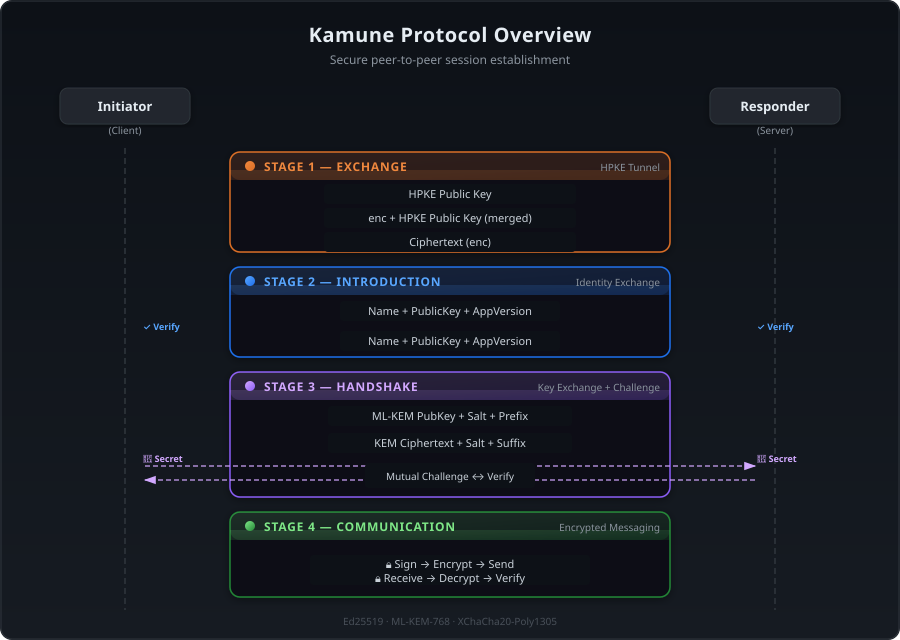
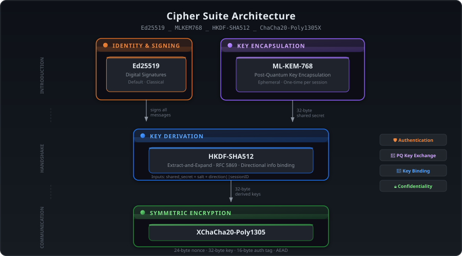
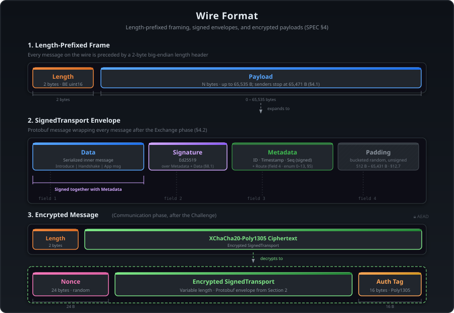
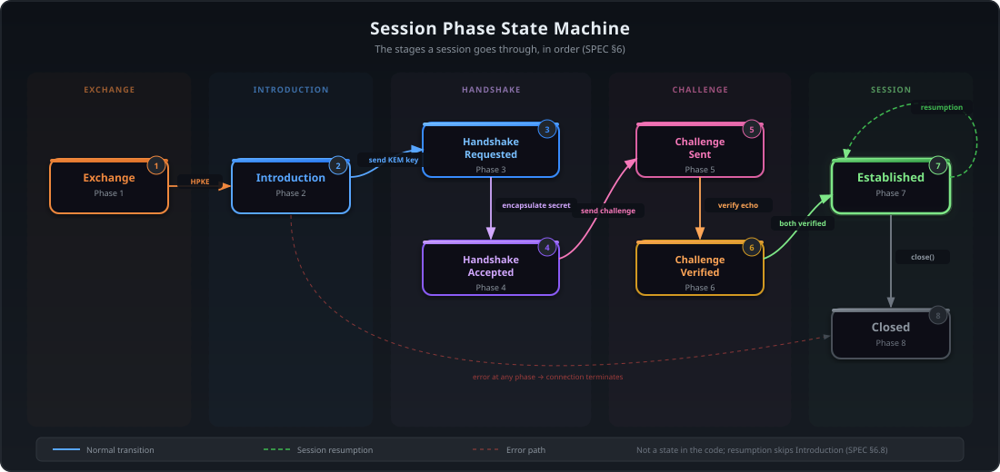
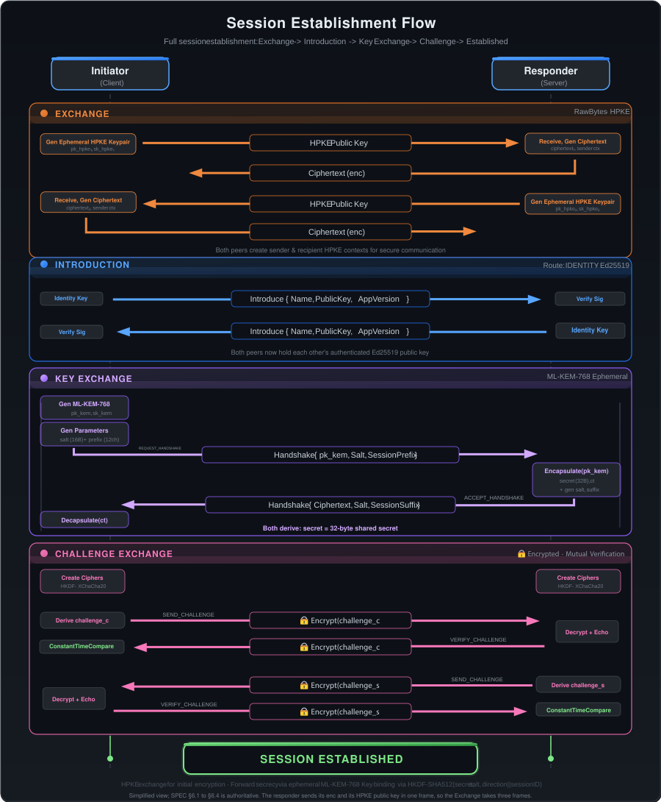
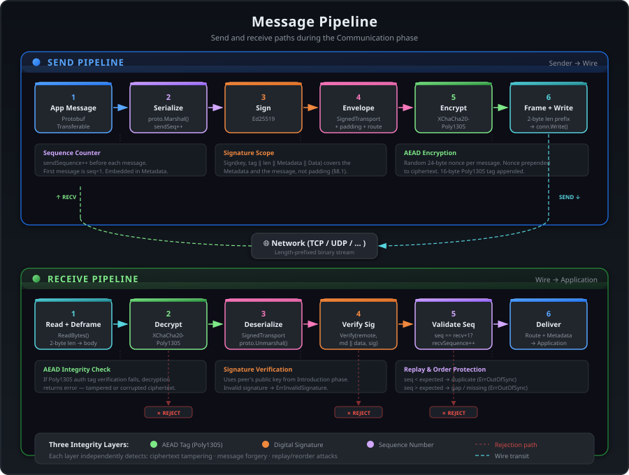
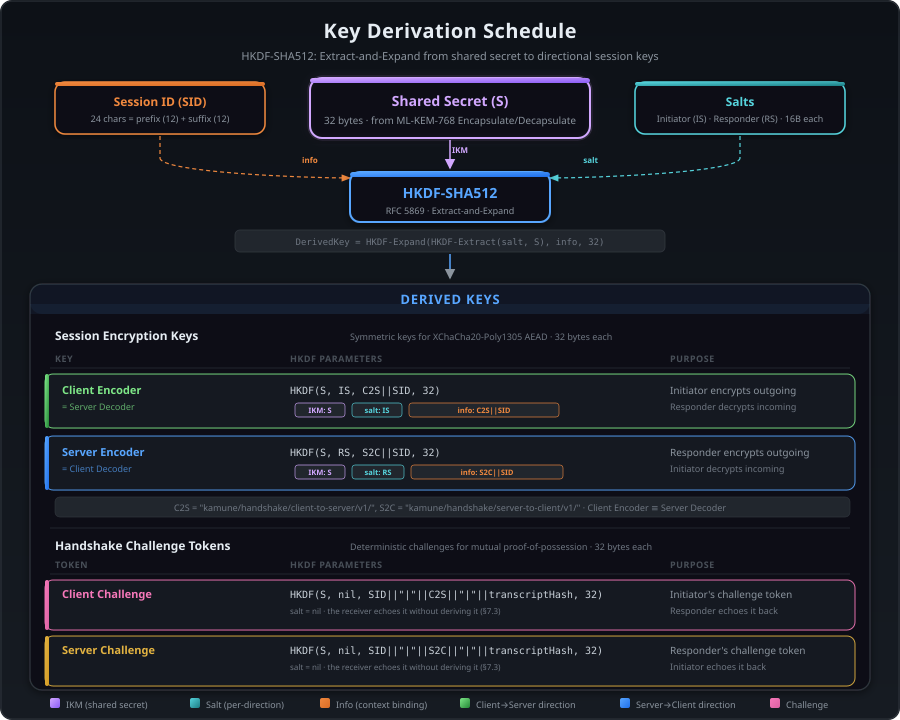
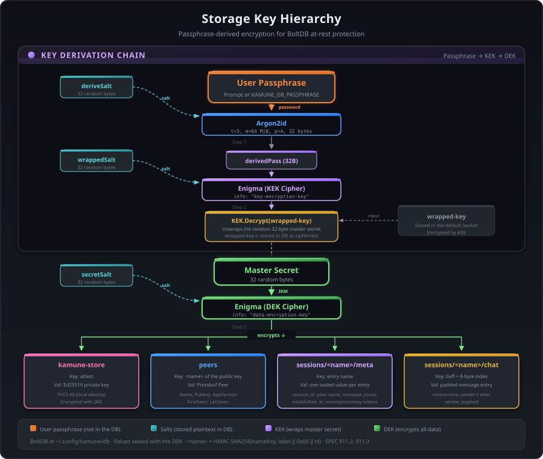

# Kamune Protocol Specification

**Version:** 0.7.0

**Status:** Experimental

**Suite:** `Ed25519_MLKEM768_HKDF-SHA512_ChaCha20-Poly1305X`

**Authors:** Kamune core team

---

## Table of Contents

1. [Overview](#1-overview)
2. [Terminology](#2-terminology)
3. [Cipher Suite](#3-cipher-suite)
4. [Wire Format](#4-wire-format)
   - 4.1 [Length-Prefixed Framing](#41-length-prefixed-framing)
   - 4.2 [Envelope Fields](#42-envelope-fields)
   - 4.3 [Encrypted Messages](#43-encrypted-messages)
5. [Routes](#5-routes)
   - 5.1 [Route Validation Rules](#51-route-validation-rules)
   - 5.2 [Session Data](#52-session-data)
6. [Protocol Flow](#6-protocol-flow)
   - 6.1 [Exchange](#61-exchange)
   - 6.2 [Introduction](#62-introduction)
   - 6.3 [Handshake](#63-handshake)
   - 6.4 [Challenge Exchange](#64-challenge-exchange)
   - 6.5 [Communication](#65-communication)
   - 6.6 [Session Teardown](#66-session-teardown)
   - 6.7 [Keep-Alive](#67-keep-alive)
   - 6.8 [Session Resumption](#68-session-resumption)
7. [Encryption and Key Derivation](#7-encryption-and-key-derivation)
   - 7.1 [Exchange Phase Keys](#71-exchange-phase-keys)
   - 7.2 [Handshake Phase Key Derivation](#72-handshake-phase-key-derivation)
   - 7.3 [Challenge Tokens](#73-challenge-tokens)
   - 7.4 [Session AEAD Construction](#74-session-aead-construction)
   - 7.5 [Key Hierarchy Summary](#75-key-hierarchy-summary)
   - 7.6 [Resumption Token Derivation](#76-resumption-token-derivation)
8. [Message Integrity and Replay Protection](#8-message-integrity-and-replay-protection)
   - 8.1 [Digital Signatures](#81-digital-signatures)
   - 8.2 [Sequence Numbers](#82-sequence-numbers)
   - 8.3 [AEAD Authentication](#83-aead-authentication)
   - 8.4 [Multi-Layer Integrity](#84-multi-layer-integrity)
9. [Transport Layer](#9-transport-layer)
   - 9.1 [TCP](#91-tcp)
   - 9.2 [UDP (via KCP)](#92-udp-via-kcp)
   - 9.3 [Relay](#93-relay)
   - 9.4 [Connection Contract](#94-connection-contract)
10. [Endpoint Roles](#10-endpoint-roles)
    - 10.1 [Responder Role](#101-responder-role)
    - 10.2 [Initiator Role](#102-initiator-role)
    - 10.3 [Role Summary](#103-role-summary)
11. [Storage and Persistence (Implementation Profile)](#11-storage-and-persistence-implementation-profile)
    - 11.1 [Database](#111-database)
    - 11.2 [Database Encryption](#112-database-encryption)
    - 11.3 [Stored Entities](#113-stored-entities)
    - 11.4 [Peer Expiration](#114-peer-expiration)
    - 11.5 [Upgrades and Deleted Data](#115-upgrades-and-deleted-data)
12. [Security Properties](#12-security-properties)
    - 12.1 [Confidentiality](#121-confidentiality)
    - 12.2 [Integrity](#122-integrity)
    - 12.3 [Authentication](#123-authentication)
    - 12.4 [Forward Secrecy](#124-forward-secrecy)
    - 12.5 [Post-Quantum Resistance](#125-post-quantum-resistance)
    - 12.6 [Replay Protection](#126-replay-protection)
    - 12.7 [Traffic Analysis Resistance](#127-traffic-analysis-resistance)
13. [Constants and Limits](#13-constants-and-limits)
14. [Error Conditions](#14-error-conditions)
15. [Merged RFCs](#15-merged-rfcs)

---

## 1. Overview

Kamune is a peer-to-peer communication protocol designed for secure, real-time
messaging over untrusted networks. It provides end-to-end encryption with
post-quantum resistance, forward secrecy, mutual authentication, and message
integrity.

The protocol operates in five sequential stages — **Exchange**,
**Introduction**, **Handshake**, **Challenge**, and **Communication** —
establishing a cryptographically secured
bidirectional channel between two peers without requiring an intermediary server.
When the session ends, a **Session Teardown** phase sends a close notification
before closing the transport, allowing peers to distinguish a graceful
disconnect from a network failure.

<picture>
  
</picture>

---

## 2. Terminology

| Term                     | Definition                                                                                                                                                                                                                         |
| ------------------------ | ---------------------------------------------------------------------------------------------------------------------------------------------------------------------------------------------------------------------------------- |
| **Initiator (Client)**   | The party that opens the connection and begins the protocol exchange.                                                                                                                                                              |
| **Responder (Server)**   | The party that accepts the connection and responds to protocol messages.                                                                                                                                                           |
| **Attester**             | The cryptographic identity holder; signs messages with its private key.                                                                                                                                                            |
| **Identifier**           | The verification counterpart of an Attester; verifies signatures with a public key.                                                                                                                                                |
| **Peer**                 | A remote party identified by its public key, name, and timestamps.                                                                                                                                                                 |
| **Transport**            | The encrypted, session-aware communication channel between two peers.                                                                                                                                                              |
| **Underlying Transport** | The encrypted connection used during Introduction and Handshake.                                                                                                                                                                   |
| **HPKE**                 | Hybrid Public Key Encryption (RFC 9180). Performs key encapsulation and key schedule derivation in a single operation during the Exchange phase. Configured with MLKEM768-X25519 KEM, HKDF-SHA512 KDF, and ChaCha20-Poly1305 AEAD. |
| **Enigma**               | The symmetric encryption/decryption engine wrapping XChaCha20-Poly1305 with keys derived via HKDF-SHA512.                                                                                                                          |
| **Route**                | A typed tag on each message's Metadata identifying its purpose and protocol phase.                                                                                                                                                 |
| **Fingerprint**          | A human-readable representation of a public key (emoji, hex, base64, or pseudonym).                                                                                                                                                |
| **Transcript Hash**      | A SHA-256 hash over the inner handshake field values, bound into challenge derivation to prevent replay and downgrade attacks.                                                                                                     |
| **Resumption Token**     | A single-use, 32-byte cryptographic value derived from the session's shared secret, presented by the initiator to authorize session resumption without repeating the Introduction phase.                                           |
| **Resumption Window**    | The 24-hour period after a session is established during which its resumption tokens remain valid.                                                                                                                                 |
| **Resumption Root**      | A secret derived once at session establishment from the shared secret and session ID, used solely to derive the resumption token set. Never exposed to the application.                                                            |

---

## 3. Cipher Suite

Kamune provides `Ed25519_MLKEM768_HKDF-SHA512_ChaCha20-Poly1305X` cipher suite.

<picture>
  
</picture>

| Component                | Algorithm          | Purpose                                                                                                                        |
| ------------------------ | ------------------ | ------------------------------------------------------------------------------------------------------------------------------ |
| **Identity Signing**     | Ed25519            | Digital signatures for authentication and message integrity during Introduction, Handshake, and all signed transports.         |
| **Key Establishment**    | MLKEM768           | Handshake KEM (FIPS 203). The Exchange phase additionally uses the MLKEM768-X25519 hybrid HPKE KEM. Ephemeral keypairs are used per session. |
| **Key Derivation**       | HKDF-SHA512        | HMAC-based extract-and-expand function to bind derived secrets to the session.                                                 |
| **Transport Encryption** | ChaCha20-Poly1305X | Extended-nonce AEAD cipher for bidirectional message encryption and authentication during the Communication phase.             |

---

## 4. Wire Format

<picture>
  
</picture>

### 4.1 Length-Prefixed Framing

All messages are transmitted using a **length-prefixed framing** protocol over
the underlying transport. The protocol is transport-agnostic; see §9.4 for the
connection contract that any transport must satisfy:

```
+------------------+--------------------+
| Length (2 bytes)  | Payload (N bytes) |
+------------------+--------------------+
```

- **Length**: A 2-byte unsigned integer in **big-endian** byte order indicating
  the size of the payload in bytes.
- **Payload**: The serialized message, exactly `Length` bytes long.
- **Wire format maximum**: 65,535 bytes (uint16 max). The length prefix is a
  2-byte unsigned integer, so payloads larger than 65,535 bytes cannot be
  expressed on the wire.
- **Protocol limit (`maxTransportSize`)**: A separate, smaller value that bounds
  the user-message size. Defined as 65,535 minus `reservedProtocolOverhead`.
  See §13 for current values.

Senders MUST NOT emit a payload larger than 65,535 bytes and MUST reject a user
message whose encoded form would exceed `maxTransportSize`. Receivers MUST read
exactly `Length` bytes before processing a frame. A truncated frame is invalid.
Implementations over byte streams MUST serialize complete frame writes; partial
underlying writes are an I/O concern and MUST be completed or treated as an
error before another frame is written.

### 4.2 Envelope Fields

Every message after the Exchange phase is wrapped in a `SignedTransport`
envelope. The Exchange phase uses the raw HPKE key-exchange frames defined in
§6.1.

```
SignedTransport {
  bytes Data      = 1;   // Serialized inner message
  bytes Signature = 2;   // Ed25519 signature (see §8.1)
  bytes Metadata  = 3;   // Pre-serialized Metadata (opaque; see below)
  bytes Padding   = 4;   // Random padding (bucketed; see §12.7)
}
```

| Field       | Type  | Role                                                                                                                                                                                                       |
| ----------- | ----- | ---------------------------------------------------------------------------------------------------------------------------------------------------------------------------------------------------------- |
| `Data`      | bytes | The serialized inner message (for example, an `Introduce` or `Handshake` message, or application data).                                                                                                    |
| `Signature` | bytes | Ed25519 signature over the domain-separated signing input (see §8.1), produced with the sender's identity private key.                                                                                     |
| `Metadata`  | bytes | Pre-serialized `Metadata` message (ID, timestamp, sequence, route), carried as opaque bytes. Serialized once by the sender; those same bytes are used both on the wire and as part of the signature input. |
| `Padding`   | bytes | Random bytes that pad the serialized envelope up to a bucketed target size (see §12.7). Padding is not part of the signature input; encrypted session frames authenticate it with the AEAD tag.                 |

All message definitions in this document use Protocol Buffers proto3 binary
encoding. The `Metadata` field contains the raw proto3 encoding of a
`Metadata` message:

```
Metadata {
  string                    ID        = 1;
  google.protobuf.Timestamp Timestamp = 2;
  uint64                    Sequence  = 3;
  Route                     Route     = 4;
}
```

| Field       | Type      | Role                                                                                                                                         |
| ----------- | --------- | -------------------------------------------------------------------------------------------------------------------------------------------- |
| `ID`        | string    | Unique message identifier (random text).                                                                                                     |
| `Timestamp` | Timestamp | Sender's claimed send time (informational only — the receiver does not validate or trust this value; storage ordering uses the local clock). |
| `Sequence`  | uint64    | Monotonically increasing per-session send counter (see §8.2).                                                                                |
| `Route`     | `Route`   | Identifies the message's purpose and protocol phase (see §5).                                                                                |

### 4.3 Encrypted Messages

Once a session is established (after the Handshake and Challenge Exchange), the
entire serialized `SignedTransport` payload is encrypted before transmission:

```
Wire format for encrypted messages:
+------------------+--------------------------------------+
| Length (2 bytes)  | XChaCha20-Poly1305 Ciphertext       |
+------------------+--------------------------------------+

Ciphertext layout:
+-------------------+---------------------------+---------+
| Nonce (24 bytes)  | Encrypted SignedTransport | Tag     |
+-------------------+---------------------------+---------+
```

The 24-byte nonce is generated randomly for each encryption operation and
prepended to the ciphertext. The Poly1305 authentication tag is appended by the
AEAD construction.

The Exchange-phase HPKE tunnel uses ChaCha20-Poly1305 (RFC 9180 AEAD, 12-byte
nonce) internally. That is distinct from the session AEAD above. Introduction,
Handshake, and Challenge messages ride the HPKE tunnel; after the session is
established, Communication frames use only XChaCha20-Poly1305 over the raw
connection.

---

## 5. Routes

Routes are typed tags embedded in every `SignedTransport` message. They identify
the message's purpose and enforce the expected protocol state-machine
transitions.

```
enum Route {
  ROUTE_INVALID            = 0;
  ROUTE_IDENTITY           = 1;
  ROUTE_REQUEST_HANDSHAKE  = 2;
  ROUTE_ACCEPT_HANDSHAKE   = 3;
  ROUTE_FINALIZE_HANDSHAKE = 4;
  ROUTE_SEND_CHALLENGE     = 5;
  ROUTE_VERIFY_CHALLENGE   = 6;
  ROUTE_EXCHANGE_MESSAGES  = 7;
  ROUTE_CLOSE_TRANSPORT    = 8;
  ROUTE_PING               = 9;
  ROUTE_PONG               = 10;
  ROUTE_RESUME_REQUEST     = 11;
  ROUTE_RESUME_ACCEPT      = 12;
  ROUTE_SESSION_DATA       = 13;
}
```

| Value | Name                       | Phase         | Direction             | Purpose                                      |
| ----- | -------------------------- | ------------- | --------------------- | -------------------------------------------- |
| `0`   | `ROUTE_INVALID`            | —             | —                     | Invalid/unset route. MUST be rejected.       |
| `1`   | `ROUTE_IDENTITY`           | Introduction  | Bidirectional         | Identity exchange (`Introduce` message).     |
| `2`   | `ROUTE_REQUEST_HANDSHAKE`  | Handshake     | Initiator → Responder | ML-KEM public key, salt, and session prefix. |
| `3`   | `ROUTE_ACCEPT_HANDSHAKE`   | Handshake     | Responder → Initiator | KEM ciphertext, salt, and session suffix.    |
| `4`   | `ROUTE_FINALIZE_HANDSHAKE` | Handshake     | —                     | Reserved for future handshake finalization.  |
| `5`   | `ROUTE_SEND_CHALLENGE`     | Challenge     | Bidirectional         | Challenge token (encrypted).                 |
| `6`   | `ROUTE_VERIFY_CHALLENGE`   | Challenge     | Bidirectional         | Challenge response echo (encrypted).         |
| `7`   | `ROUTE_EXCHANGE_MESSAGES`  | Communication | Bidirectional         | Application-layer messages.                  |
| `8`   | `ROUTE_CLOSE_TRANSPORT`    | Communication | Bidirectional         | Graceful session teardown.                   |
| `9`   | `ROUTE_PING`               | Keep-Alive    | Bidirectional         | Ping message with 8-byte random token.       |
| `10`  | `ROUTE_PONG`               | Keep-Alive    | Bidirectional         | Pong response echoing the ping token.        |
| `11`  | `ROUTE_RESUME_REQUEST`     | Resumption    | Initiator → Responder | Session ID and resumption token.             |
| `12`  | `ROUTE_RESUME_ACCEPT`      | Resumption    | Responder → Initiator | Acceptance or rejection of resume request.   |
| `13`  | `ROUTE_SESSION_DATA`       | Communication | Bidirectional         | Session-level metadata exchange (see §5.2).  |

### 5.1 Route Validation Rules

- Routes `1–6` are **handshake routes** and MUST only appear during session
  establishment.
- Routes `7–8` and `13` are **session routes** and MUST only appear after a session is
  fully established.
  - Route `8` (`ROUTE_CLOSE_TRANSPORT`) signals a **graceful teardown**.
    Upon receiving this route, the receiver MUST close the session and surface
    a peer-disconnected condition to the application layer. No further
    messages should be processed for this session.
  - Route `13` (`ROUTE_SESSION_DATA`) carries session-level metadata between
    peers. The payload is a `SessionData` message with arbitrary key-value
    fields. The application layer is responsible for dispatching and handling
    the fields it recognizes; unknown fields MUST be ignored.
- Routes `9–10` are **keep-alive routes** for application-level ping/pong.
  The application layer is responsible for responding to `ROUTE_PING` messages
  with `ROUTE_PONG` echoes. The `Transport` delivers the frame to the caller
  without special handling.
- Routes `11–12` are **resumption routes** and MUST only appear during session
  resumption, after the Exchange phase but before the Handshake. If the server
  does not support resumption, receiving `ROUTE_RESUME_REQUEST` MUST be treated
  as an unexpected-route condition.
- Route `4` (`ROUTE_FINALIZE_HANDSHAKE`) is defined in the enum but is
  **reserved** and not currently used by the protocol.
- Any message with `ROUTE_INVALID` (`0`) or an unrecognized route value MUST
  be rejected.

### 5.2 Session Data

Route `13` (`ROUTE_SESSION_DATA`) provides a generic, in-band mechanism for
peers to exchange session-level metadata. The payload is a `SessionData`
protobuf message:

```
SessionData {
  map<string, bytes> Fields = 1;
}
```

`Fields` is an open namespace. Peers send key-value pairs where the key is a
UTF-8 string and the value is opaque bytes. The application layer inspects known
keys and silently ignores any it does not recognize, allowing the protocol to
evolve without breaking backward compatibility.

#### Use Cases

**Relay token derivation.** After a session is established, peers may need
reconnection tokens for relay-based transports. Both peers generate an ephemeral
X25519 keypair, send the public key via `SessionData` with the key
`"ecdh_pubkey"`, and compute a shared secret via ECDH. A pool of 3 reconnection
tokens is derived from the shared secret using HKDF-Expand with the info prefix
`"kamune/relay-reconnect/v1/"`. The shared secret is never stored; only the
derived tokens are persisted. See `docs/RELAY.md` for details.

#### Design Constraints

- `ROUTE_SESSION_DATA` messages participate in the same sequence-number space
  as application messages. The sequence-number rules of §8.2 apply.
- Messages are encrypted and signed like any other session message.
- The route is bidirectional — either peer may send `SessionData` at any time
  after the session is established.
- The application MUST NOT block session teardown or error handling on
  unreceived `SessionData` fields.

---

## 6. Protocol Flow

A new session establishment consists of three sub-protocols executed in
sequence: Introduction, Handshake, and Challenge Exchange. The Exchange phase
precedes all three to provide an encrypted tunnel for the handshake messages.
Peers who have previously established a session may alternatively use the
resumption path described in §6.8, which replaces the Introduction phase with
a token-based authorization exchange.

<picture>
  
</picture>

### 6.1 Exchange

The Exchange phase establishes an encrypted tunnel over the raw connection
using HPKE (Hybrid Public Key Encryption, RFC 9180) with the MLKEM768-X25519
hybrid KEM. This protects the subsequent Introduction and Handshake messages
from eavesdropping.

The HPKE info parameter is the empty byte string.

```
Initiator (Client)             Responder (Server)
       |                            |
       |  ------ frame -----------> |
       |      HPKE Public Key       |
       |                            |
       |  <------ frame ----------  |
       |      enc || HPKE Public Key|
       |      (length-prefixed)     |
       |                            |
       |  ------ frame -----------> |
       |      enc                   |
       |                            |
```

**Step-by-step (Initiator):**

1. Generate an ephemeral HPKE key pair using the MLKEM768-X25519 KEM and send
   the public key to the responder.
2. Receive the merged message (a 2-byte length prefix for `enc`, followed by
   `enc`, followed by the responder's public key), create an HPKE recipient
   context using the local private key and the responder's `enc`, and create
   an HPKE sender context from the responder's public key.
3. Generate and send the encapsulated ciphertext (`enc`) to the responder.

**Step-by-step (Responder):**

1. Receive the initiator's public key, create an HPKE sender context, and
   generate an ephemeral HPKE key pair.
2. Send the encapsulated ciphertext (`enc`) and public key as a single merged
   message (2-byte length prefix + ciphertext + public key).
3. Receive the initiator's encapsulated ciphertext (`enc`) and create an HPKE
   recipient context using the local private key and the initiator's `enc`.

Both sides now hold a paired sender and recipient, enabling bidirectional
authenticated encryption. The encrypted tunnel carries the remaining handshake
messages transparently.

#### 6.1.1 HPKE Suite Configuration

The HPKE suite uses the following parameters:

| Parameter              | Value      | Description                                                  |
| ---------------------- | ---------- | ------------------------------------------------------------ |
| KEM                    | `0x647a`   | MLKEM768-X25519 hybrid KEM (X-Wing, draft-ietf-lamps-xwing)  |
| KDF                    | `0x0003`   | HKDF-SHA512                                                  |
| AEAD                   | `0x0003`   | ChaCha20-Poly1305                                            |
| Public key size        | 1216 bytes | Concatenation of MLKEM768 (1184B) + X25519 (32B) public keys |
| Encapsulated key (enc) | 1120 bytes | Concatenation of MLKEM768 (1088B) + X25519 (32B) ciphertexts |
| Merged R→I response    | 2338 bytes | 2-byte length prefix + 1120B enc + 1216B public key          |

The X-Wing hybrid combiner produces the combined shared secret as:

```
sharedSecret = SHA3-256(ss_MLKEM768 || ss_X25519 || ct_X25519 || pk_X25519 || 0x5c2e2f2f5e5c)
```

Where `0x5c2e2f2f5e5c` is the X-Wing domain-separation label (`\./  /^\`).
The MLKEM768 component uses ML-KEM-768 (FIPS 203, Module-Lattice-Based
Key-Encapsulation Mechanism) in ephemeral-ephemeral mode.

### 6.2 Introduction

The Introduction phase establishes mutual awareness of each peer's identity.

```
Introduce {
  string Name       = 1;  // Human-readable peer name
  bytes  PublicKey  = 2;  // Identity public key (PKIX/DER)
  string AppVersion = 3;  // Application semver
}
```

| Field        | Type   | Role                                                                                           |
| ------------ | ------ | ---------------------------------------------------------------------------------------------- |
| `Name`       | string | Human-readable peer name. Defaults to a SHA-256 fingerprint of the public key, encoded as unpadded base64url. |
| `PublicKey`  | bytes  | The peer's identity public key (Ed25519), serialized in PKIX/DER format.                       |
| `AppVersion` | string | The peer's application semver (for example, `"0.5.0"`).                                        |

```
Initiator (Client)                          Responder (Server)
       |                                           |
       |  ---- SignedTransport[IDENTITY] ------>   |
       |        Introduce { ... }                  |
       |                                           |
       |   <---- SignedTransport[IDENTITY] -----   |
       |         Introduce { ... }                 |
       |                                           |
```

**Step-by-step:**

1. **Initiator sends `Introduce`** (route: `ROUTE_IDENTITY`):
   - The `Metadata` is assembled and serialized to bytes.
   - The `SignedTransport` envelope's signature is computed over the
     domain-separated signing input (see §8.1) covering both the metadata bytes
     and the serialized `Introduce` message, using the initiator's identity
     private key.

2. **Responder receives and validates**:
   - Parses the `PublicKey` using the appropriate identity-algorithm parser.
   - Verifies the signature over the domain-separated signing input (metadata
     bytes || data) using the parsed public key.
   - If signature verification fails, the connection MUST be terminated.
   - Checks `AppVersion` against its own version using semver comparison.
     Version matching follows a three-tier policy:

     | Condition                        | Action                                                                                                                                                                                              |
     | -------------------------------- | --------------------------------------------------------------------------------------------------------------------------------------------------------------------------------------------------- |
     | Major differs                    | **Hard reject** — connection terminated as an incompatible version. Different major versions imply incompatible protocol semantics.                                                                 |
     | Minor differs (pre-1.0, major=0) | **Hard reject** — treated as a breaking change before v1.0. Connection terminated as an incompatible version.                                                                                       |
     | Minor differs (major ≥ 1)        | **Warning** — the connection proceeds, but a structured warning is recorded. Client applications SHOULD surface this warning to the user, as the remote peer may have a newer or older feature set. |
     | Only patch differs               | **Silent ignore** — patch versions are always compatible and the difference is not checked.                                                                                                         |

   - The responder's **Remote Verifier** is invoked — a pluggable callback
     that decides whether to accept or reject the peer. The default
     implementation displays the peer's emoji and hex fingerprints and prompts
     for interactive confirmation. Known peers are looked up in persistent
     storage; new peers may be stored upon acceptance.

3. **Responder sends its own `Introduce`** (route: `ROUTE_IDENTITY`):
   - Same structure as step 1, but with the responder's identity.

4. **Initiator receives and validates**:
   - Same verification as step 2, applied to the responder's introduction.

After both introductions are verified and accepted, both sides hold each
other's authenticated public key and proceed to the Handshake.

### 6.3 Handshake

<picture>
  
</picture>

The Handshake phase uses post-quantum MLKEM768 to establish a shared key and
derive session-specific symmetric encryption keys. The HPKE-encrypted tunnel
from the Exchange phase is used as transport.

```
Handshake {
  bytes  Key        = 1;  // MLKEM768 public key or KEM ciphertext
  bytes  Salt       = 2;  // 16 bytes of random salt
  string SessionKey = 3;  // 12-char half (cold) or 24-char ID (resume)
}
```

| Field        | Type   | Role                                                                                       |
| ------------ | ------ | ------------------------------------------------------------------------------------------ |
| `Key`        | bytes  | MLKEM768 public key (request) or KEM ciphertext (response).                                |
| `Salt`       | bytes  | 16 bytes of cryptographically random salt generated by the sender.                         |
| `SessionKey` | string | Cold: 12-character base32 half. Resume: the full 24-character session ID. |

For a cold handshake, `SessionKey` MUST be exactly 12 ASCII characters drawn
from `ABCDEFGHIJKLMNOPQRSTUVWXYZ234567`. For a resumed handshake, it MUST be
the complete, previously established 24-character session ID. The initiator
and responder MUST send the same complete value during a resumed handshake.

```
Initiator                                    Responder
    |                                            |
    |  ---- SignedTransport[REQUEST_HS] ----->   |
    |        Handshake {                         |
    |          Key:  MLKEM PublicKey             |
    |          Salt: 16 random bytes,            |
    |          SessionKey: 12-char prefix        |
    |        }                                   |
    |                                            |
    |   <---- SignedTransport[ACCEPT_HS] -----   |
    |         Handshake {                        |
    |          Key: KEM enc (encapsulated key)   |
    |          Salt: 16 random bytes,            |
    |          SessionKey: 12-char suffix        |
    |         }                                  |
    |                                            |
```

**Step-by-step:**

1. **Initiator generates an ephemeral MLKEM key pair**:
   - A fresh key pair is generated. This key pair is **ephemeral** — used for
     this session only and discarded afterward.

2. **Initiator generates session parameters**:
   - `localSalt`: 16 bytes of cryptographically random data.
   - `sessionPrefix`: 12 characters of random base32 text (uppercase A-Z,
     2-7), generated from the custom alphabet `ABCDEFGHIJKLMNOPQRSTUVWXYZ234567`.

3. **Initiator sends `Handshake` request** (route: `ROUTE_REQUEST_HANDSHAKE`):
   - `Key`: The MLKEM public key bytes.
   - `Salt`: The initiator's local salt.
   - `SessionKey`: The session-ID prefix.
   - Wrapped in a `SignedTransport` envelope signed with the initiator's
     identity key.

4. **Responder receives and validates the request**:
   - The `SignedTransport` signature is verified using the initiator's public
     key (from the Introduction phase).
   - The route is validated to be `ROUTE_REQUEST_HANDSHAKE`.
   - The salt length and the session-key form are validated; any other value is
     rejected. A cold handshake accepts only a 12-character half; a resumed
     handshake accepts only the pre-agreed 24-character session ID.

5. **Responder generates session parameters**:
   - `localSalt`: 16 bytes of cryptographically random data.
   - `sessionSuffix`: 12 characters of random base32 text.
   - `sessionID`: Concatenation of `sessionPrefix + sessionSuffix` (24
     characters total).

6. **Responder performs MLKEM encapsulation**:
   - Encapsulates against the initiator's public key, deriving the shared
     secret and producing the encapsulated key (`enc`).

7. **Responder creates per-direction symmetric ciphers**:
   - **Outbound (responder → initiator)**:
     derived from the shared secret, the responder's local salt, and
     `"kamune/handshake/server-to-client/v1/" + sessionID`.
   - **Inbound (initiator → responder)**:
     derived from the shared secret, the initiator's salt, and
     `"kamune/handshake/client-to-server/v1/" + sessionID`.
   - The domain-separated directional info strings and per-side salts ensure
     the two directions use distinct keys.

8. **Responder sends `Handshake` response** (route: `ROUTE_ACCEPT_HANDSHAKE`):
   - `Key`: The KEM encapsulated key (`enc`).
   - `Salt`: The responder's local salt.
   - `SessionKey`: The session-ID suffix.

9. **Initiator receives the response and derives the secret**:
   - Verifies the signature and route.
   - Validates the salt length and the session-key form.
   - Constructs `sessionID = sessionPrefix + sessionSuffix`.
   - Decapsulates the responder's `enc` to derive the same shared secret.

10. **Initiator creates per-direction symmetric ciphers** (mirrored):
    - **Outbound (initiator → responder)**:
      derived from the shared secret, the initiator's salt, and
      `"kamune/handshake/client-to-server/v1/" + sessionID`.
    - **Inbound (responder → initiator)**:
      derived from the shared secret, the responder's salt, and
      `"kamune/handshake/server-to-client/v1/" + sessionID`.

11. **Both compute the transcript hash**:
    - `transcriptHash = SHA-256("kamune/handshake/v1" || for each field in {req.Key, req.Salt, req.SessionKey, resp.Key, resp.Salt, resp.SessionKey} { uint32_be(len(field)) || field })`.
    - The hash binds both inner handshake payloads together, in the order
      they appear above, and is used in the subsequent Challenge Exchange.

At this point, both parties hold the same shared secret, matching per-direction
cipher pairs, and a shared transcript hash. The ephemeral MLKEM private key is
discarded.

### 6.4 Challenge Exchange

The Challenge phase is a mutual proof-of-possession protocol that confirms
both parties can correctly encrypt and decrypt using their derived session
keys.

```
Initiator                                     Responder
    |                                             |
    |  ---- Encrypted[SEND_CHALLENGE] -------->   |
    |        challenge_c                          |
    |                                             |
    |  <---- Encrypted[VERIFY_CHALLENGE] ------   |
    |        echo(challenge_c)                    |
    |                                             |
    |  <---- Encrypted[SEND_CHALLENGE] --------   |
    |        challenge_s                          |
    |                                             |
    |  ---- Encrypted[VERIFY_CHALLENGE] ------>   |
    |        echo(challenge_s)                    |
    |                                             |
    |       [Both: Phase = Established]           |
```

**Step-by-step:**

1. **Initiator generates and sends challenge**:
   - Derives a 32-byte challenge token:
     `HKDF-SHA512(secret, empty, sessionID || 0x7c || handshakeC2SInfo ||
     0x7c || transcriptHash, 32)`.
     The `secret` is the shared secret from the Handshake phase and
     `handshakeC2SInfo` is `"kamune/handshake/client-to-server/v1/"`.
   - The transcript hash binds the challenge to the specific handshake
     payloads, preventing replay and downgrade attacks.
   - Encrypts and sends the token (route: `ROUTE_SEND_CHALLENGE`). This is
     the first message encrypted with the session's symmetric keys.

2. **Responder receives, decrypts, and echoes**:
   - Receives and decrypts the challenge.
   - Re-encrypts the same challenge bytes with its outbound cipher.
   - Sends the echo back (route: `ROUTE_VERIFY_CHALLENGE`).

3. **Initiator verifies the echo**:
   - Decrypts the response and performs a **constant-time comparison** against
     the original challenge.
   - If the comparison fails, the handshake MUST be aborted.

4. **Responder generates and sends its own challenge**:
   - Derives a 32-byte challenge token:
     `HKDF-SHA512(secret, empty, sessionID || 0x7c || handshakeS2CInfo ||
     0x7c || transcriptHash, 32)`
     where `handshakeS2CInfo` is `"kamune/handshake/server-to-client/v1/"`.
   - Encrypts and sends it (route: `ROUTE_SEND_CHALLENGE`).

5. **Initiator receives, decrypts, and echoes**:
   - Same echo protocol as step 2.

6. **Responder verifies the echo**:
   - Same verification as step 3.

7. **Both parties enter the `Established` phase**.

The challenge exchange proves that:

- The initiator can decrypt messages encrypted by the responder (and vice
  versa).
- Both parties derived the same shared secret and exported identical keys.
- The session ID is agreed upon.

### 6.5 Communication

Once the session is `Established`, peers exchange application messages using
the `Transport`:

<picture>
  
</picture>

**Sending a message:**

1. The sender increments its send counter (starting from 0; the first
   `Transport` message is sequence 1). Challenge messages (§6.4) already use
   this counter, so the first Communication-phase message is sequence 3.
2. The application message is serialized (`Data`).
3. `Metadata` is assembled (`ID`, `Timestamp`, `Sequence`, `Route`) and
   serialized once to `MetadataBytes`.
4. The signature is computed over the domain-separated signing input (see §8.1)
   covering `MetadataBytes` and `Data`, using the sender's identity key.
5. The signature, `Data`, `MetadataBytes`, and random padding are assembled into
   a `SignedTransport` envelope — `MetadataBytes` is placed directly into the
    `Metadata` field as-is, not re-serialized.
6. The entire `SignedTransport` is serialized to bytes.
7. The bytes are encrypted using the sender's outbound cipher
   (XChaCha20-Poly1305 with a fresh 24-byte random nonce).
8. The ciphertext is written to the connection using length-prefixed framing.

**Receiving a message:**

1. The receiver reads the length prefix and then the full ciphertext payload.
2. The ciphertext is decrypted using the receiver's inbound cipher.
3. The decrypted bytes are deserialized into a `SignedTransport` envelope.
4. The signature is verified against the remote peer's public key using the
   domain-separated signing input (see §8.1) covering the raw `Metadata` bytes
   and `Data`.
5. Only after verification succeeds is `Metadata` decoded from the raw bytes
   for application use.
6. The sequence number is validated: it MUST equal the last received
   sequence + 1.
   - If the sequence is **less than** expected, the message is a duplicate and
     the session MUST be closed.
   - If the sequence is **greater than** expected, messages have been lost and
     the session MUST be closed.
7. After successful sequence validation, the receive counter is updated.
8. The inner message is deserialized into the expected type.
9. The route and metadata are returned to the application layer.

### 6.6 Session Teardown

When a peer decides to close a session, it performs a **graceful teardown**:

1. The peer sends a `ROUTE_CLOSE_TRANSPORT` message with an empty payload,
   encrypted as a regular session message.
2. After the close message is written, the underlying transport connection
   is closed.
3. The receiving peer decrypts the message, detects `ROUTE_CLOSE_TRANSPORT`,
   and surfaces a peer-disconnected condition from its receive operation.
4. The receiving peer's receive loop exits cleanly, and the application may
   surface a "Peer disconnected" notification.

If the transport connection is dropped without a `ROUTE_CLOSE_TRANSPORT` message
(for example, network failure, crash), the receiving peer surfaces a
connection-closed condition instead. This allows applications to distinguish:

| Condition         | Meaning                                            |
| ----------------- | -------------------------------------------------- |
| Peer disconnected | Remote peer closed the session gracefully.         |
| Connection closed | The connection was dropped (network issue, crash). |

The close message is sent **best-effort** — if the connection is already broken,
the send is skipped and the transport is closed directly.

When a peer sends or receives `ROUTE_CLOSE_TRANSPORT`, the session is considered
intentionally closed, and all stored resumption tokens for that session MUST be
invalidated. This prevents an explicitly torn-down session from being resumed
later. See §6.8.1 for details on token invalidation scope.

### 6.7 Keep-Alive

Peers may probe liveness using an application-level ping/pong exchange over
routes `9` and `10`. Ping/pong messages follow the same sequence-number space
and encryption as session messages. The keep-alive mechanism is implemented
entirely at the application layer; the `Transport` treats these as ordinary
frames.

**Ping flow:**

1. The caller generates 8 random bytes as a freshness token.
2. Sends the token with route `ROUTE_PING`.
3. Waits for a response on an application-owned channel with a timeout.
4. The application's receive loop dispatches incoming `ROUTE_PONG` frames
   to the channel.
5. Verifies the received route is `ROUTE_PONG` and the echoed data matches
   the original token.
6. If the token does not match, or the timeout expires, the ping is treated
   as failed.

**Pong handler:**

The application's receive loop MUST handle incoming `ROUTE_PING` frames by
extracting the token data and sending it back with `ROUTE_PONG`.

### 6.8 Session Resumption

Resumption allows two peers who have previously completed a full session to
re-establish communication without repeating the Introduction phase. The
underlying connection and all in-memory transport state are destroyed on
disconnect; resumption produces a **new session** — fresh handshake, fresh keys,
fresh sequence counters — distinguished from a cold start only by reusing the
original session ID and skipping the remote-verifier callback. (RFC001)

Resumption is a recovery mechanism for involuntary session interruptions —
network failures, application crashes, and relay-enforced TTL expiry. It allows
the dialer to re-establish communication without repeating the Introduction
phase, using pre-derived tokens.

Resumption is **not** a persistence mechanism for intentionally closed sessions.
When a peer explicitly tears down a session (§6.6), all resumption tokens for
that session are invalidated, and the session cannot be resumed later.

Resumption tokens are derived from the MLKEM768 shared secret established during
the session's handshake (§7.6). The protocol flow is as follows:

```
Initiator                                   Responder
    |                                            |
    |  ------- Exchange (HPKE tunnel) -------->  |   (§6.1, unchanged)
    |                                            |
    |  ---- SignedTransport[RESUME_REQUEST] -->  |
    |        ResumeRequest {                     |
    |          SessionID: <original ID>          |
    |          Token: token_n                    |
    |        }                                   |
    |                                            |
    |  <--- SignedTransport[RESUME_ACCEPT] ----  |
    |        ResumeAccept { Accepted: true }     |
    |                                            |
    |  ---- SignedTransport[REQUEST_HS] ------>  |   (§6.3, both sides
    |        Handshake {                         |    send the full session
    |          SessionKey: <full sessionID>      |    ID instead of random
    |        }                                   |    halves)
    |                                            |
    |  <--- SignedTransport[ACCEPT_HS] --------  |
    |        Handshake {                         |
    |          SessionKey: <full sessionID>      |
    |        }                                   |
    |                                            |
    |  ============ Challenge Exchange =======>  |   (§6.4, unchanged)
    |                                            |
    |       [Both: Established]                  |
    |       [Both: regenerate token set]         |
```

#### 6.8.1 Token Lifecycle

- **Single-use, any-order.** Each token may be consumed exactly once. There is
  no requirement to consume tokens in a specific order. This avoids a
  synchronization hazard: an any-order, mark-on-use scheme has no such
  dependency.
- **Regeneration on success.** When a resumption completes (the resumed session
  reaches `Established`), both peers discard the entire previous token set and
  derive a fresh set from the new session's shared secret (§7.6). A token stolen
  from session _k_ is worthless after session _k+1_'s handshake completes, since
  it is not derivable from the new shared secret.
- **Expiration.** A session's tokens become invalid after the resumption window
  (24 hours) elapses from the session's `Established` timestamp, regardless of
  how many tokens remain unused. A session with no unused tokens or past its
  window is **unresumeable** — the initiator must fall back to a full
  Introduction.
- **Invalidation on explicit close.** Tokens are cleared when the session is
  intentionally closed (§6.6). Involuntary disconnections (network failure,
  crash, relay TTL) do **not** invalidate tokens.

#### 6.8.2 Wire Messages

Both messages are sent inside the HPKE-encrypted tunnel established during the
Exchange phase — the same tunnel that protects Introduction and Handshake
messages. The raw token value is therefore never sent in the clear.

```
ResumeRequest {
  string SessionID = 1;
  bytes  Token     = 2;
}

ResumeAccept {
  bool   Accepted = 1;
  string Reason   = 2;
}
```

| Field       | Type   | Role                                                                    |
| ----------- | ------ | ----------------------------------------------------------------------- |
| `SessionID` | string | The original session ID being resumed.                                  |
| `Token`     | bytes  | One unused resumption token for that session.                           |
| `Accepted`  | bool   | Whether the resume request was accepted.                                |
| `Reason`    | string | Populated only when `Accepted` is false; describes the rejection cause. |

#### 6.8.3 Responder Validation

On receiving a resume request, the responder:

1. Looks up the session ID in persistent storage. If not found, the request is
   rejected.
2. Verifies the signature against the stored public key of the initiator. If
   invalid, the request is rejected and the connection is terminated.
3. Checks the resumption window has not elapsed. If expired, the request is
   rejected.
4. Checks the presented token is present in the session's unused token set. If
   not found (already used, or never valid), the request is rejected.
5. On success: marks the token used, sends a resume-accept with
   `Accepted: true`, and proceeds directly into the Handshake phase (§6.3) —
   skipping the Introduction phase and the remote-verifier callback entirely.
6. On any rejection: sends a resume-accept with `Accepted: false` and a reason
   string. The initiator may retry with a cold Introduction (§6.2).

#### 6.8.4 Resumption Asymmetry

Resumption is always initiated by the dialer. The server accepts incoming resume
requests but never sends one. If the server disconnects, it simply waits for the
dialer to reconnect and attempt resumption. Role reversal — the original server
dialing the original client — does not occur in practice; dialer and server
roles are fixed for the lifetime of the application.

The server MAY disable resumption, in which case incoming `ROUTE_RESUME_REQUEST`
messages are treated as unexpected-route conditions, forcing a full Introduction
from the dialer. Resumption is enabled by default.

#### 6.8.5 Session ID Semantics

The session ID continues to mean exactly what it means in a cold session: the
cryptographic handle for one Transport's lifetime. Resumption does not change
this — it lets both sides agree on the session ID in advance instead of
generating it randomly.

The practical effect of the shared session ID is purely at the storage layer:
the application's session message log (§11.3) keys on session ID, so messages
from the resumed session append to the same log entry rather than opening a new
one. During the Handshake phase, both sides send the full predetermined session
ID instead of each side generating a random half.

---

## 7. Encryption and Key Derivation

<picture>
  
</picture>

### 7.1 Exchange Phase Keys

During the Exchange phase, HPKE with the MLKEM768-X25519 hybrid KEM produces
paired sender and recipient contexts directly. No additional key derivation
is performed — the HPKE library handles key scheduling internally using
HKDF-SHA512 (KDF) and ChaCha20-Poly1305 (AEAD).

### 7.2 Handshake Phase Key Derivation

The MLKEM768 encapsulation produces a 32-byte shared secret. Per-direction
symmetric cipher keys are derived using HKDF-SHA512:

```
encoderKey = HKDF-SHA512(secret, localSalt, directionInfo + sessionID, 32)
decoderKey = HKDF-SHA512(secret, remoteSalt, oppositeInfo + sessionID, 32)
```

Where:

- `secret`: 32-byte MLKEM768 shared secret.
- `localSalt`: 16 random bytes from the local party.
- `remoteSalt`: 16 random bytes from the remote party.
- `sessionID`: 24-character concatenation of prefix + suffix (12 + 12).
- Direction info strings are domain-separated:
  - Client-to-server: `"kamune/handshake/client-to-server/v1/"`
  - Server-to-client: `"kamune/handshake/server-to-client/v1/"`

### 7.3 Challenge Tokens

Challenge tokens are derived using the same HKDF-SHA512:

```
challenge = HKDF-SHA512(
    IKM = secret,
    salt = empty,
    info = UTF8(sessionID) || 0x7c || UTF8(directionInfo) || 0x7c || transcriptHash,
    L = 32,
)
```

The transcript hash binds the challenge to the specific session's handshake
payloads, preventing replay and downgrade attacks.

### 7.4 Session AEAD Construction

Each directional session key is used with XChaCha20-Poly1305. For every
encryption, the sender generates a fresh 24-byte random nonce and emits
`nonce || ciphertext || tag`. The receiver extracts the first 24 bytes as the
nonce and verifies the remaining bytes with XChaCha20-Poly1305. No associated
data is used.

### 7.5 Key Hierarchy Summary

| Phase             | Key Material                   | Derivation                                                                         |
| ----------------- | ------------------------------ | ---------------------------------------------------------------------------------- |
| Exchange          | HPKE sender/recipient contexts | HPKE internal key schedule (MLKEM768-X25519 + HKDF-SHA512 + ChaCha20-Poly1305)     |
| Handshake         | 32-byte shared secret          | MLKEM768 Encapsulate/Decapsulate                                                   |
| Cipher keys       | 32-byte per-direction keys     | HKDF-SHA512(secret, salt, domainInfo + sessionID)                                  |
| Challenge tokens  | 32-byte tokens                 | `HKDF-SHA512(secret, empty, sessionID || 0x7c || dirInfo || 0x7c || transcriptHash, 32)` |
| Resumption tokens | 32-byte per-token values       | Defined exactly in §7.6                                                        |

### 7.6 Resumption Token Derivation

At session establishment, after the Challenge Exchange succeeds, each peer
derives a 32-byte resumption root:

```
resumptionRoot = HKDF-SHA512(
    IKM = sharedSecret,
    salt = UTF8(sessionID),
    info = UTF8("kamune/resumption-root/v1"),
    L = 32,
)
```

The root is never stored or exposed to the application. Each peer then derives
exactly 20 tokens, indexed from 0 through 19 inclusive. For token `i`, let
`I = uint32_be(i)`:

```
token[i] = HKDF-SHA512(
    IKM = resumptionRoot,
    salt = empty,
    info = UTF8("kamune/resumption/token/v1/") || I,
    L = 32,
)
```

Both peers independently derive the same token set without an additional
message exchange.

---

## 8. Message Integrity and Replay Protection

### 8.1 Digital Signatures

Every `SignedTransport` message includes a digital signature over the
domain-separated signing input:

```
SigningInput = "kamune/transport-sign/v1" || varint(len(MetadataBytes)) || MetadataBytes || Data
```

Where `MetadataBytes` is the raw bytes of the `Metadata` field (pre-serialized
by the sender), and `Data` is the serialized inner message. The `varint` is an
unsigned base-128 variable-length integer encoding the byte length of
`MetadataBytes`. The signature is computed using the sender's long-term identity
key (Ed25519). The receiver verifies the signature using the sender's public key
obtained during the Introduction phase.

This provides:

- **Authentication**: Proof that the message was created by the claimed sender.
- **Integrity**: Any modification to `Metadata` or `Data` invalidates the
  signature.
- **Non-repudiation**: The sender cannot deny having sent the message (though
  this is a peer-to-peer context, so non-repudiation is limited to the two
  parties).

### 8.2 Sequence Numbers

Each `Transport` maintains two monotonically increasing 64-bit unsigned
counters:

- A **send counter**: Incremented before each outgoing message. The first
  message has sequence `1`.
- A **receive counter**: Tracks the last received sequence number. Starts at
  `0`.

**Validation rules on receive:**

| Condition                    | Action                                                                    |
| ---------------------------- | ------------------------------------------------------------------------- |
| `seq == receive counter + 1` | Accept; update the receive counter.                                       |
| `seq < receive counter + 1`  | Reject as **duplicate**. Close the session and surface an out-of-sync error. |
| `seq > receive counter + 1`  | Reject as **gap/missing messages**. Close the session and surface an out-of-sync error. |

Sequence numbers provide ordering guarantees and replay protection within a
session.

### 8.3 AEAD Authentication

The XChaCha20-Poly1305 AEAD cipher provides ciphertext authentication. Any
tampering with the encrypted payload (including the nonce) will cause
decryption to fail, ensuring that only the holder of the derived symmetric key
can produce valid cipher texts.

### 8.4 Multi-Layer Integrity

Kamune employs defense-in-depth with three independent integrity mechanisms:

1. **AEAD tag** (Poly1305): Authenticates the ciphertext at the encryption
   layer.
2. **Digital signature** (Ed25519): Authenticates the plaintext message and
   its metadata (ID, timestamp, sequence, route) at the signing layer using a
   domain-separated signing input (see §8.1).
3. **Sequence number**: Provides ordering and replay protection at the session
   layer.

---

## 9. Transport Layer

The transport layer carries the length-prefixed frames of §4.1 between the two
endpoints of a session. Kamune supports several transport backends out of the
box and is open to others through the connection contract of §9.4.

### 9.1 TCP

TCP is the default transport. It provides the reliable, ordered byte-stream
delivery the protocol assumes, and the length-prefixed framing of §4.1 operates
directly over the TCP stream.

### 9.2 UDP (via KCP)

For environments where TCP is unavailable or undesirable, kamune supports
UDP-based transport using KCP, which provides reliable, ordered delivery over
UDP. The same framing and protocol messages are used identically over KCP.

KCP provides ARQ for reliability, Reed-Solomon forward error correction, and
congestion control.

### 9.3 Relay

For NAT traversal or peers that cannot reach each other directly, kamune ships a
relay transport. The relay is a blind, stateless, token-based session switch: a
listener connects, receives a short random token, and shares it out of band; the
dialer connects with the same token. End-to-end authentication and encryption
are unchanged from §6; the relay only forwards encrypted frames.

See [`docs/RELAY.md`](RELAY.md) for the wire format, threat model, and
operational details.

### 9.4 Connection Contract

Every transport — TCP, UDP/KCP, relay, or a custom backend — exposes the same
minimal interface to the protocol:

```
interface Conn {
    ReadBytes() -> (bytes, error)
    WriteBytes(data: bytes) -> error
    SetDeadline(deadline: Timestamp) -> error
    Close() -> error
}
```

Where:

- **`ReadBytes`**: Reads a single length-prefixed frame. Reads the 2-byte
  big-endian length prefix, then exactly that many payload bytes. Returns the
  payload, or an error if the read fails or the frame is truncated. Successful
  reads MUST be reliable, in wire order, and free of duplicate frames.
- **`WriteBytes`**: Writes a single length-prefixed frame. Prepends a 2-byte
  big-endian length prefix and writes the full payload atomically (retrying on
  partial writes). Returns an error if the write fails.
- **`SetDeadline`**: Sets an absolute time bound for subsequent `ReadBytes` and
  `WriteBytes` operations. Passing a zero value clears the deadline.
- **`Close`**: Releases the underlying transport. Subsequent calls return an
  error.

The contract is the only requirement the protocol imposes. A conforming
implementation MUST serialize its outbound session messages so that their wire
order is the same as their sequence-number order. It MUST deliver inbound
frames reliably and in that wire order, without duplicates. Sending and
receiving may otherwise proceed concurrently.

An implementation may additionally expose the underlying connection object (for
example, a `net.Conn` in environments that provide one) for callers that need
transport-specific metadata.

This contract is also the plug-in point for custom transports. The transport
layer exposes a Listener (accepts incoming connections and yields `Conn` values)
and a Dial function (opens outgoing connections and returns a `Conn`). Any
backend that can express itself in those two shapes is a valid kamune transport.

---

## 10. Endpoint Roles

This section describes endpoint roles, not a required programming interface.
An implementation MAY use different names or expose different APIs.

### 10.1 Responder Role

A server listens for incoming connections and, for each one, runs the
Introduction → Handshake → Challenge Exchange sequence in the responder role.

Server flow per connection:

1. Run the Exchange phase as responder (§6.1).
2. Receive the initiator's `Introduce`, verify its signature and version.
3. Invoke the remote-verifier callback to accept or reject the peer.
4. Send the responder's own `Introduce`.
5. Run the Handshake phase as responder, including the Challenge Exchange.
6. Hand the established `Transport` to the application's session handler.

Common implementation parameters include:

- **Handshake timeout**: 30 seconds.
- **Transport**: pluggable. The Server accepts TCP connections by default, and
  the same interface accepts a custom listener or connection factory for UDP/KCP,
  relay, or any other transport satisfying the connection contract (§9.4).
- **Session handler**: A user-supplied callback invoked once per established
  session, receiving the `Transport`.

### 10.2 Initiator Role

A dialer opens outgoing connections and runs the same handshake sequence in
the initiator role.

Dialer flow:

1. Establish the underlying connection. The default is a TCP dial to the given
   address; a custom dial function may be supplied for UDP/KCP, relay, or any
   other transport satisfying the connection contract (§9.4).
2. Run the Exchange phase as initiator (§6.1).
3. Send the initiator's `Introduce`.
4. Receive and verify the responder's `Introduce`.
5. Run the Handshake phase as initiator, including the Challenge Exchange.
6. Return the established `Transport` to the caller.

Common implementation parameters include:

- **Dial timeout**: 10 seconds.
- **Handshake timeout**: 30 seconds.
- **Transport**: pluggable. The Dialer opens a TCP connection by default, and
  the same interface accepts a custom dial function for UDP/KCP, relay, or any
  other transport satisfying the connection contract (§9.4).

### 10.3 Role Summary

| Role           | Behaviour                                                                                   |
| -------------- | ------------------------------------------------------------------------------------------- |
| **Server**     | Listens for connections, runs the handshake as responder, hands off to a session handler.   |
| **Dialer**     | Opens a connection, runs the handshake as initiator, returns the `Transport` to the caller. |
| **Transport**  | Encrypted, session-aware bidirectional channel returned once the session is `Established`.  |
| **Connection** | The framing-aware byte transport feeding the protocol; see §9.4.                            |

---

## 11. Storage and Persistence (Implementation Profile)

This section is non-normative. It describes the reference implementation's
local persistence profile and is not required for protocol interoperability.

<picture>
  
</picture>

### 11.1 Database

The reference implementation persists its state in an embedded key-value store located at
`~/.config/kamune/db` by default. The location is overridable via the
`KAMUNE_DB_PATH` environment variable.

A missing database directory is created with mode 0700, and the default
`~/.config/kamune` directory is restricted to 0700 on every open; a directory
chosen by the caller is left as it is. The database file is created with mode
0600, and every open removes group and other permission bits from it, logging
a warning, or fails when it cannot. These modes are not applied on Windows.

Symbolic links in the database path are resolved when the database is opened.
While the database is open, the implementation holds an exclusive lock on a
file next to it, named after the database with a `.lock` suffix (mode 0600).
Other opens of the same database wait for that lock, up to the open timeout
(5 seconds by default). The lock file is never deleted; tools that copy or
clean up the database directory should leave it in place while a client runs.
Releases up to v0.6.0 do not take this lock, so such a client must not open the
database while a newer one may rewrite it.

Some operations rewrite the whole database file: the key upgrades described in
§11.2, a passphrase change, and compaction (§11.5). The new file is written
next to the database as `<db>.rewrite-<digits>` and renamed over it, so it is
a new file, owned by the current user, with mode 0600. Other hard links to the
old file, and copies such as backups, keep the old contents. A copy left
behind by an interrupted rewrite is removed on the next open. When the lock
file cannot be created, for example in a read-only directory, these rewrites
fail, and a database written by an older release, which needs them, does not
open (§11.5).

### 11.2 Database Encryption

The database contents are encrypted at rest using a key hierarchy:

1. **Passphrase** → `Argon2id(passphrase, deriveSalt, t=3, m=64 MiB, p=4, 32)` → `derivedPass`.
2. `derivedPass` → `Enigma(derivedPass, wrappedSalt, "key-encryption-key")` → **KEK** (Key Encryption Key cipher).
3. A random 32-byte **secret** is encrypted by the KEK and stored as the
   wrapped key material.
4. `secret` → `Enigma(secret, secretSalt, "data-encryption-key")` → **DEK** (Data Encryption Key cipher).
5. All sensitive data (the local identity, peers, sessions, chat history) is
   encrypted and decrypted using the DEK.

`Enigma(key, salt, info)` is XChaCha20-Poly1305 under the key
`HKDF-SHA512(key, salt, info, 32)`. Step 1 uses the second recommended
Argon2id option of RFC 9106, so every passphrase guess costs 64 MiB of memory
and about a tenth of a second on a current laptop; opening the database costs
the same. The HKDF in step 2 keeps the KEK separate from any other use of
`derivedPass`.

The three salts (`deriveSalt`, `wrappedSalt`, `secretSalt`, 32 random bytes
each), the wrapped key and the Argon2id parameters (`kdf-params`) are stored as
plaintext metadata. The passphrase itself is never stored. `kdf-params` is 10
bytes: an algorithm identifier (1 for Argon2id), the time cost and the memory
cost in KiB as big-endian uint32 values, and the parallelism as one byte. An
open rejects stored parameters above 1 GiB of memory or 4 GiB of total work
(time × memory). It also rejects key metadata that is malformed or partly
missing, or missing from a database that holds data, instead of writing a new
key hierarchy over it.

Databases written before `kdf-params` existed derived `derivedPass` with
`HKDF-SHA512(passphrase, deriveSalt, "derived-passphrase-key", 32)`, which has
no work factor. The first successful open of such a database, or of one whose
Argon2id parameters are below the defaults, wraps the secret again under
Argon2id, with each parameter raised to at least its default, and with fresh
`deriveSalt` and `wrappedSalt`. The database file is then rewritten so that the
old wrapped key does not remain in it.

Every value that is sealed under the DEK carries associated data that names
where it is stored: a version byte (1), the number of buckets on its path as a
big-endian uint32, then each bucket name and the key, each prefixed with its
length as a big-endian uint32. A value copied to another key or bucket, by
someone who can write the file but does not hold the DEK, then fails to open.
This binding does not stop an old value from being put back at the key it
came from.

A database is bound once all its values are sealed this way, which a
`value-binding` entry in the default bucket records; the entry is sealed under
the DEK with associated data of its own. A bound database opens a value only
with its location. Databases written before the binding existed hold values
without associated data. The first open of such a database with its lock file
(§11.1) replaces the data key, seals every value again under the new key with
its location, writes the marker and rewrites the file. A value taken from an
older copy of the file therefore opens nowhere in a bound database. Restoring
the whole key metadata of an older, unbound copy, with the passphrase
unchanged, takes the database back to that copy. A database that is not bound
yet, because it was opened without its lock file or its upgrade failed, still
opens values without associated data. Releases without the binding cannot read
the values of a bound database. A custom storage backend does its own
encryption and should bind values the same way.

Changing the passphrase replaces the data key, not only its wrapping: every
value is encrypted again under a new secret, which is wrapped under the new
passphrase, and the database file is rewritten. Copies of the old file, such as
backups, still open with the old passphrase.

If the deployment disables the passphrase requirement (the no-passphrase
option), the empty passphrase goes through the same derivation. Anyone with the
file can then derive the KEK, so the encryption gives no protection, while each
open still costs one Argon2id run. This mode is intended for embedded and test
scenarios and SHOULD NOT be used where the database file may be exposed.

### 11.3 Stored Entities

| Entity                       | Contents                                                                                                                                   | Encryption      |
| ---------------------------- | ------------------------------------------------------------------------------------------------------------------------------------------ | --------------- |
| **Local identity**           | The local attester's Ed25519 private key (PKCS #8), under `attest` in the default bucket.                                                  | Encrypted (DEK) |
| **Peers**                    | One record per known peer: name, identity public key, application version, first-seen time, last-seen time.                                | Encrypted (DEK) |
| **Session metadata**         | Per session: the session ID, a display name, the message count, and relay reconnection tokens that the application stores.                 | Encrypted (DEK) |
| **Session message log**      | Per session: messages in the order they were stored, each with the local receive time, the sender's timestamp, the sender and the payload. | Encrypted (DEK) |
| **Session resumption state** | Per session: unused resumption tokens, the remote peer's public key, and the time of the session's cold handshake (`established_at`).      | Encrypted (DEK) |
| **Settings**                 | Application settings, one value per application name and key.                                                                              | Encrypted (DEK) |

Peers, sessions and settings are stored under keyed names:
`HMAC-SHA256(nameKey, label || 0x00 || id)`, where `id` is the peer's
PKIX/DER-encoded public key, the session ID, or the setting's application name
and key joined by a colon, and `label` is `kamune/storage/peer/v1`,
`kamune/storage/session/v1` or `kamune/storage/setting/v1`. `nameKey` is 32
random bytes stored under `name-key` in the default bucket, sealed under the
DEK. Without the passphrase, the file therefore does not show which public
keys, session IDs or settings it holds, and a guess cannot be checked against
it. A passphrase change keeps the name key, so someone who knew an older
passphrase can still check guesses against later copies of the file. Since a
session's keyed name does not give its ID back, the ID is also stored in the
session's metadata.

The encryption hides values, not the shape of the database. The following are
stored in plaintext:

- The bucket structure: the default bucket (`kamune-store`), `peers`,
  `sessions` and `settings`, and the `meta` and `chat` buckets of each session.
- The number of peers, sessions, messages in each session, and settings.
- The key metadata of §11.2, and the names of the other entries in the default
  bucket (`attest`, `name-key`, `storage-format`, `compact-pending` and
  `value-binding`).
- The names of each session's metadata entries (`session_id`, `peer`,
  `established_at`, `resumption_tokens`, `relay_tokens`, `name` and
  `message_count`) and the lengths of their values.
- The index each message is stored under, which shows only the order of the
  messages.
- The length of each sealed value. A message entry is padded to 512 bytes, 1,
  4, 16, 32 or 64 KiB, or a multiple of 64 KiB, before it is sealed, and a
  setting value to a multiple of 64 bytes. Other values are not padded.

The library does not store peers itself: the application stores a peer,
typically once it has verified it. After every cold handshake and resumption
that stores session state, the implementation sets the remote peer's
last-seen time to the current time, if the peer is stored. Resumption looks
the peer up by the key stored for the session, so a session whose peer was
deleted or has expired cannot be resumed.

Each message is stored under the next index of its session, so the message
log returns messages in the order they were stored. The receive time comes
from the local clock. The sender's timestamp is kept for display only and
never orders the log (§4.2). The message count is updated with every stored
message, so listing sessions does not read their whole logs. Storing a message
for a session that is not stored, such as one deleted while still connected,
stores that session again with the message.

Every cold handshake stores a new session. To bound what a peer adds by
connecting and closing repeatedly, storing a new session also deletes the
oldest idle sessions with the same peer, those with no messages and no display
name, beyond 8 per peer, counting the new one. The limit is configurable and
can be turned off. It does not bound sessions that hold messages. An idle
session that is still connected can be deleted this way, and it then cannot be
resumed.

The resumption root itself is not stored — only the derived token set. A
database compromise exposes only the remaining unused tokens for sessions
within their resumption window, not a generator capable of producing tokens
for future sessions. (RFC001, §9)

### 11.4 Peer Expiration

Peer records have a configurable expiration duration (default: 7 days). On
lookup, if `firstSeen + expiryDuration < now`, the peer is automatically
deleted and a peer-expired condition is surfaced. Expired peers are also
pruned during full-iteration listings.

### 11.5 Upgrades and Deleted Data

The default bucket records the version of the database layout under
`storage-format`; the current version is 2. Version 1 stores messages under
indexes, with their receive time and sender in the sealed value, and version 2
stores peers, sessions and settings under keyed names (§11.3). A database
without the entry was written by v0.6.0 or earlier and is version 0. A
database in a newer layout than the implementation knows does not open.

Opening a database in an older layout first applies the key upgrades of §11.2,
which need the lock file. If they fail, for example on a full disk or without
the lock file, the open fails and the file stays as the older release wrote
it; every later open tries again. Otherwise the layout is converted and the
new version recorded, together with a `compact-pending` mark. Every open
compacts the database while the mark is present and removes the mark once a
compaction succeeds, so until then the old layout can remain in free pages.
The first open after an upgrade rewrites the whole file and can take a while.
v0.6.0 and earlier cannot open an upgraded database. A legacy session value
that does not decrypt is left under the session's old name, so that session's
ID stays in the file in plaintext.

The database engine does not overwrite the pages that deletes and updates
free: their old contents, sealed under the same DEK, stay in the file until
the engine reuses them. Compaction rewrites the file with only live data
(§11.1). Deleting a session or a peer compacts the database; if the
compaction fails, the record is deleted all the same and the failure is
reported. Deleting a peer keeps its sessions. Other changes, such as popping a
resumption token, deleting idle sessions or expired peers, or replacing a
value, leave the old value in a free page until the next compaction. Freed
disk blocks of the old file, such as blocks an SSD remaps, and copies of the
file such as backups, are not scrubbed.

---

## 12. Security Properties

### 12.1 Confidentiality

All application messages are encrypted with ChaCha20-Poly1305X using
session-specific keys established with the post-quantum MLKEM768 KEM. Only
the two session participants can decrypt the messages.

### 12.2 Integrity

Messages are protected by three independent mechanisms: AEAD authentication
tags, domain-separated digital signatures over metadata and data, and
sequence-number validation.

### 12.3 Authentication

Both peers are authenticated during the Introduction phase via domain-separated
digital signatures over their identity messages and metadata (see §8.1). The
Challenge Exchange confirms that both parties derived the same shared secret
and can operate the symmetric ciphers.

### 12.4 Forward Secrecy

Each session uses an ephemeral MLKEM key pair. The shared key is derived from
this ephemeral key encapsulation, not from the long-term identity keys.
Compromise of a long-term identity key does not reveal past session keys.

Within a single session, the same symmetric keys are used for all messages
(no per-message ratcheting). Forward secrecy is per-session, not per-message.

### 12.5 Post-Quantum Resistance

The MLKEM768 KEM provides resistance against quantum-computer attacks on the
key establishment. It ensures that the protocol remains secure as long as
ML-KEM-768 remains unbroken, providing defense in depth against quantum
adversaries.

With the default Ed25519 signing, the key establishment is quantum-resistant
but the identity signatures are not. An attacker with a quantum computer
could forge signatures but could not recover session keys from observed key
encapsulations.

### 12.6 Replay Protection

Monotonically increasing sequence numbers prevent message replay, duplication,
and reordering. AEAD nonces are randomly generated per encryption, preventing
nonce reuse.

### 12.7 Traffic Analysis Resistance

Every `SignedTransport` envelope MUST be padded to a bucketed target size
before encryption. Padding is applied uniformly across all routes.

**Buckets.** The sender pads the envelope to the smallest bucket that fits
the serialized size, then probabilistically bumps it up one or more levels.

| Bucket | Target size (pre-encryption)                                                                     |
| ------ | ------------------------------------------------------------------------------------------------ |
| 1      | 512 B                                                                                            |
| 2      | 1 KB                                                                                             |
| 3      | 4 KB                                                                                             |
| 4      | 16 KB                                                                                            |
| 5      | 32 KB                                                                                            |
| 6      | 65,495 B (the maximum that, after AEAD expansion, fits in a single 2-byte length-prefixed frame) |

**Cross-bucket randomness.** After selecting the natural bucket, the sender
bumps it with the following probability distribution:

| Bump     | Probability |
| -------- | ----------- |
| 0 (stay) | 80%         |
| +1       | 15%         |
| +2       | 4%          |
| +3       | 1%          |

The bump is selected independently per message and capped at bucket 6.

---

## 13. Constants and Limits

| Constant                   | Value                                  | Description                                                                                                             |
| -------------------------- | -------------------------------------- | ----------------------------------------------------------------------------------------------------------------------- |
| `maxTransportSize`         | 61,439 bytes (~60 KiB)                 | Maximum user-message size. The user-message cap is the wire-format maximum (65,535) minus a reserved protocol overhead. |
| `reservedProtocolOverhead` | 4,096 bytes (4 KiB)                    | Reserved bytes per message for signature + metadata + padding + AEAD tag.                                               |
| `wireFormatMax`            | 65,535 bytes                           | Wire format's hard upper bound (uint16 max).                                                                            |
| `paddingBuckets`           | {512, 1024, 4096, 16384, 32768, 65495} | Bucketed padding target sizes (pre-encryption). See §12.7.                                                              |
| `bumpProbabilities`        | {80%, 15%, 4%, 1%}                     | Cross-bucket bump distribution (stay, +1, +2, +3). See §12.7.                                                           |
| `handshakeSaltSize`        | 16 bytes                               | Size of random salts for handshake key derivation                                                                       |
| `handshakeChallengeSize`   | 32 bytes                               | Size of handshake challenge tokens                                                                                      |
| `sessionIDLength`          | 24 characters                          | Total session-ID length (12 prefix + 12 suffix)                                                                         |
| `base32Alphabet`           | `ABCDEFGHIJKLMNOPQRSTUVWXYZ234567`     | Custom base32 alphabet (excludes 0/O/1/I) used for session-ID halves                                                    |
| `nonceSize`                | 24 bytes                               | XChaCha20-Poly1305 nonce size                                                                                           |
| `keySize`                  | 32 bytes                               | ChaCha20-Poly1305 / HKDF output key size                                                                                |
| `defaultReadTimeout`       | 5 minutes                              | Default read deadline applied to the underlying transport                                                               |
| `defaultWriteTimeout`      | 1 minute                               | Default write deadline applied to the underlying transport                                                              |
| `defaultDialTimeout`       | 10 seconds                             | Default connection establishment timeout                                                                                |
| `defaultPeerExpiry`        | 7 days                                 | Default peer identity expiration                                                                                        |
| `lengthPrefixSize`         | 2 bytes                                | Size of the big-endian message length header                                                                            |
| `sessionPrefixLength`      | 12 characters                          | Length of the session-ID prefix emitted by the initiator                                                                |
| `sessionSuffixLength`      | 12 characters                          | Length of the session-ID suffix emitted by the responder                                                                |
| `handshakeTimeout`         | 30 seconds                             | Maximum time for the complete handshake                                                                                 |
| `pingDataSize`             | 8 bytes                                | Size of the random token in each ping message                                                                           |
| `resumptionGracePeriod`    | 24 hours                               | Time window after session establishment during which resumption tokens are valid                                        |
| `resumptionTokenCount`     | 20                                     | Number of resumption tokens derived per session                                                                         |
| `resumptionTokenSize`      | 32 bytes                               | Size of each resumption token (HKDF-SHA512 output)                                                                      |

---

## 14. Error Conditions

The following table lists protocol failure conditions. An implementation MAY
map them to language- or application-specific errors, but the stated connection
action is normative.

| Condition                                                                                                                 | Action                                                                     |
| ------------------------------------------------------------------------------------------------------------------------- | -------------------------------------------------------------------------- |
| An operation is attempted on a server that has already shut down.                                                         | Surfaced as a server-closed error.                                         |
| An operation is attempted on a connection that has already been closed.                                                   | Surfaced as a connection-closed error.                                     |
| The remote peer sends a `ROUTE_CLOSE_TRANSPORT` frame.                                                                    | Surfaced as a peer-disconnected error; the receive loop exits cleanly.     |
| A read deadline is exceeded.                                                                                              | Surfaced as a receive-timeout error. Non-fatal; the caller may retry.      |
| A signature on a received message fails verification.                                                                     | Surfaced as a signature error; the connection is terminated.               |
| A challenge echo does not match the original challenge, or the remote-verifier callback rejects the peer.                 | Surfaced as a verification error; the connection is terminated.            |
| A user message exceeds the user-message cap (~60 KiB), or its encoded frame would exceed the wire-format maximum.         | Surfaced as a message-too-large error; the message is not sent.            |
| A received sequence number does not equal the expected value (duplicate or gap).                                          | Surface an out-of-sync error, close the connection, and discard session state. |
| A received route does not match the route expected for the current protocol phase.                                        | Surfaced as an unexpected-route error; the connection is terminated.       |
| A received message uses `ROUTE_INVALID` (0) or any unrecognized route value.                                              | Surfaced as an invalid-route error; the message is rejected.               |
| The remote peer's application version is incompatible with the local version (major mismatch, or pre-1.0 minor mismatch). | Surfaced as a version-mismatch error; the connection is terminated.        |
| A peer's identity has exceeded the configured expiry duration.                                                            | Surfaced as a peer-expired error; the peer record is removed on lookup.    |
| A resume request references a session ID not found in storage.                                                            | The request is rejected; the initiator may retry with a cold Introduction. |
| A resume request signature fails verification against the stored public key.                                              | The request is rejected; the connection is terminated.                     |
| A resume request references a session whose resumption window has elapsed.                                                | The request is rejected; the initiator may retry with a cold Introduction. |
| A resume request presents a token not present in the session's unused token set.                                          | The request is rejected; the initiator may retry with a cold Introduction. |

---

## 15. Merged RFCs

This section lists RFCs that have been accepted into the protocol specification.
Each entry records the RFC identifier, title, target version, and the SPEC
sections it affects. Draft or withdrawn RFCs are not listed here.

| RFC    | Title                        | Target Version | SPEC Sections                            |
| ------ | ---------------------------- | -------------- | ---------------------------------------- |
| RFC001 | Session Resumption           | v0.6.0         | §2, §5, §6.8, §7.6, §11.3, §13, §14      |
| RFC002 | Extend Signature to Metadata | v0.7.0         | §4.2, §6.2, §6.5, §8.1, §8.4, §12.2, §15 |
